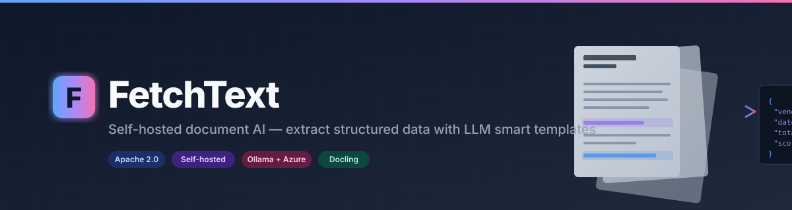
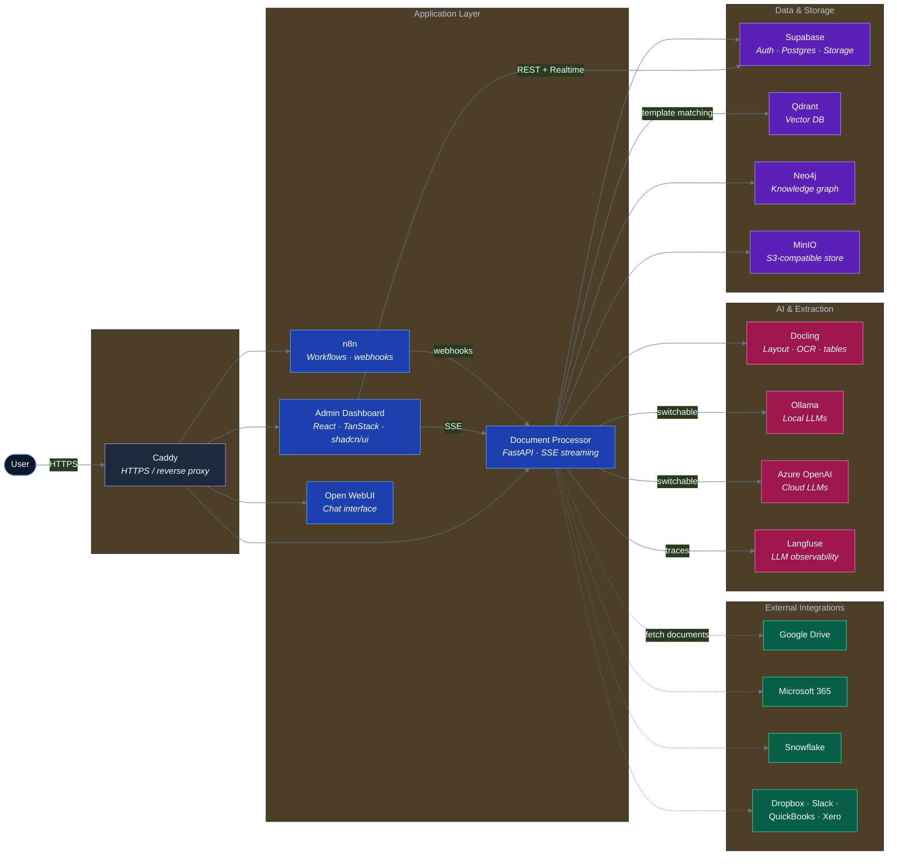

<p align="center">
  
</p>

<p align="center">
  <a href="https://github.com/nickyeager/fetchtext/actions/workflows/ci.yml"></a>
  <a href="LICENSE"></a>
  <a href="CONTRIBUTING.md"></a>
  <a href="https://github.com/nickyeager/fetchtext/issues?q=is%3Aissue+is%3Aopen+label%3A%22good+first+issue%22"></a>
</p>

**Self-hosted document processing, extraction, and generation — powered by
local or cloud LLMs.**

FetchText turns piles of contracts, invoices, forms, and reports into
structured data you can query, generate from, and integrate into your
business systems. Drop in a document, and it:

1. Extracts text (with OCR for scans)
2. Classifies it against your library of smart templates
3. Pulls structured fields using LLM-based entity extraction (no brittle
   regex)
4. Optionally generates new documents from the extracted data

It runs entirely on your own infrastructure — laptop, server, or cloud —
with your choice of local Ollama models or Azure OpenAI.

> **Built on top of** [local-ai-packaged](https://github.com/coleam00/local-ai-packaged)
> by [Cole Medin](https://github.com/coleam00). FetchText adds the document
> processor, admin dashboard, smart template system, and integration layer
> on top of that foundation. See [NOTICE](NOTICE) for full attribution.

---

## What's in the box

- **Document Processor** — FastAPI service using
  [Docling](https://github.com/DS4SD/docling) for layout-aware extraction.
  Three-tier strategy: PyMuPDF (fast embedded text) → Docling layout-only
  → Docling with OCR. Streams progress over SSE.
- **Admin Dashboard** — React/TypeScript SPA built on
  [TanStack Router](https://tanstack.com/router) and
  [shadcn/ui](https://ui.shadcn.com/). Upload, review, edit templates,
  manage integrations.
- **Smart Templates** — define a template once with field definitions; the
  system extracts those fields from any matching document using LLMs and
  vector similarity (Qdrant).
- **Integrations** — Google Drive, Microsoft 365, Dropbox, Slack,
  QuickBooks, Xero, Snowflake. OAuth + key-pair auth supported.
- **Local + Cloud LLMs** — toggle between Ollama (local) and Azure OpenAI
  per-user via the settings UI.
- **Self-hosted everything** — Supabase (auth + Postgres + storage), n8n
  (workflows), Qdrant (vector DB), Neo4j (graph), Langfuse (LLM
  observability), Open WebUI, Flowise, SearXNG — orchestrated with Docker
  Compose behind Caddy for HTTPS.

## Quickstart

### Prerequisites

- **Docker Desktop 4.30+** (Compose v2 bundled) — macOS, Linux, or
  Windows with WSL2
- **Python 3.11+** (any system Python; `start_services.py` uses only
  stdlib)
- **`openssl`** (for generating secrets — pre-installed on macOS/Linux)
- **8 GB RAM minimum**, 16 GB recommended (Docling layout models are
  the bottleneck)
- **20 GB free disk** for images + initial model downloads
- *Optional, for dashboard development:* Node 20 + pnpm 9
  (`nvm install 20 && npm install -g pnpm`)

### Run it

```bash
# 1. Clone the repo
git clone https://github.com/nickyeager/fetchtext.git
cd fetchtext

# 2. Generate strong secrets and create your .env
cp .env.example .env

# Generate the four required secrets and paste them into .env:
echo "POSTGRES_PASSWORD=$(openssl rand -base64 32 | tr -d '/+=' | head -c 32)"
echo "JWT_SECRET=$(openssl rand -hex 32)"
echo "N8N_ENCRYPTION_KEY=$(openssl rand -hex 32)"
echo "SECRET_KEY_BASE=$(openssl rand -base64 64 | tr -d '\n')"
echo "DASHBOARD_PASSWORD=$(openssl rand -base64 24)"

# Generate matching Supabase ANON_KEY and SERVICE_ROLE_KEY using the
# Supabase JWT generator — paste your JWT_SECRET in and copy the two
# tokens it gives you into .env:
#   https://supabase.com/docs/guides/self-hosting#api-keys
# (Or use the default ones from .env.example for local-only experimentation.)

# 3. Start the stack
python3 start_services.py --profile cpu
# Or: --profile gpu-nvidia / --profile gpu-amd

# 4. Wait for services to come up (~2-5 min on first launch)
curl http://localhost:8090/health   # document processor — expect: {"status":"healthy"}
open http://localhost:5173          # admin dashboard
```

**First-launch tips**
- Docling layout models (~1 GB) download lazily on first document upload
- Default login: `admin@fetchtext.local` / value of `DASHBOARD_PASSWORD`
- Stop everything: `docker compose -p localai down`
- Tail logs: `docker compose -p localai logs -f document-processor`

### Service URLs (defaults)

| Service           | URL                       |
|-------------------|---------------------------|
| Admin Dashboard   | http://localhost:5173     |
| Document API      | http://localhost:8090     |
| Supabase Studio   | http://localhost:8000     |
| n8n               | http://localhost:8001     |
| Open WebUI        | http://localhost:8002     |
| Flowise           | http://localhost:8003     |
| Langfuse          | http://localhost:8007     |
| Ollama            | http://localhost:11434    |

## Configuration

All configuration lives in `.env`. The big knobs:

- `STORAGE_BACKEND` — set to `s3` to use the bundled MinIO; required for
  document upload to work
- LLM provider — defaults to Ollama. Switch to Azure OpenAI by setting the
  `AZURE_OPENAI_*` vars and toggling provider in Settings → AI Models
- Integration OAuth credentials — see `.env.example` for Google, Microsoft,
  Dropbox, Slack, QuickBooks, Xero, Snowflake

## Troubleshooting

**`curl localhost:8090/health` hangs or 502s**
The document processor takes ~30s to come up on first boot (model
download + DB migrations). Tail logs to watch progress:
`docker compose -p localai logs -f document-processor`. Look for
*"Application startup complete"*.

**Dashboard loads but shows "Failed to fetch"**
Frontend ANON_KEY mismatch with backend. The two must come from the
same JWT_SECRET. Quickest fix: copy the demo keys from
`.env.example` straight across (local-dev only — regenerate for any
deployment).

**Docling extraction is incredibly slow**
On CPU with no GPU, layout model inference is 30–60s per page. Either
(a) switch to `--profile gpu-nvidia`, or (b) configure Azure OpenAI in
`Settings → AI Models` to bypass local LLM entirely.

**Port already in use**
Default external ports: 5173, 8000–8003, 8005, 8007, 8090, 11434. To
remap, set the matching `*_EXTERNAL_PORT` in `.env` (see `.env.example`).

**`SECRET_KEY_BASE` errors at supabase-realtime startup**
`SECRET_KEY_BASE` must be exactly 64 bytes of base64. Regenerate:
`openssl rand -base64 64 | tr -d '\n'`.

More: [`docs/guides/MIGRATION_INSTRUCTIONS.md`](docs/guides/MIGRATION_INSTRUCTIONS.md)
and [`CLAUDE.md`](CLAUDE.md) (extensive ops notes for maintainers).

## Architecture



Source: [`docs/assets/architecture.mmd`](docs/assets/architecture.mmd) ·
Full breakdown: [`docs/architecture/ARCHITECTURE.md`](docs/architecture/ARCHITECTURE.md)

## Documentation

- [Architecture](docs/architecture/ARCHITECTURE.md)
- [Project Structure](docs/architecture/PROJECT_STRUCTURE.md)
- [Document Processing Guide](docs/guides/DOCUMENT_PROCESSING_COMPLETE_GUIDE.md)
- [Template Matching](docs/guides/TEMPLATE_MATCHING_CURRENT_STATE.md)
- [LLM Entity Extraction](docs/guides/LLM_ENTITY_EXTRACTION.md)
- [Walkthroughs](docs/walkthroughs/) — end-to-end feature walkthroughs

## Status

Pre-1.0. Public API and database schema may change. We use FetchText
internally and ship breaking changes as we learn — release notes live
in [CHANGELOG.md](CHANGELOG.md).

What we're working on next is in [ROADMAP.md](ROADMAP.md). If
something there matters to you (or something missing does), open an
issue.

## Contributing

We welcome contributions. See [CONTRIBUTING.md](CONTRIBUTING.md) for setup,
code standards, and the PR process. Please follow our
[Code of Conduct](CODE_OF_CONDUCT.md).

For security issues, see [SECURITY.md](SECURITY.md) — please do not open
public issues for vulnerabilities.

## License

Apache License 2.0 — see [LICENSE](LICENSE).
Includes upstream code from `local-ai-packaged` (also Apache 2.0); see
[NOTICE](NOTICE).
