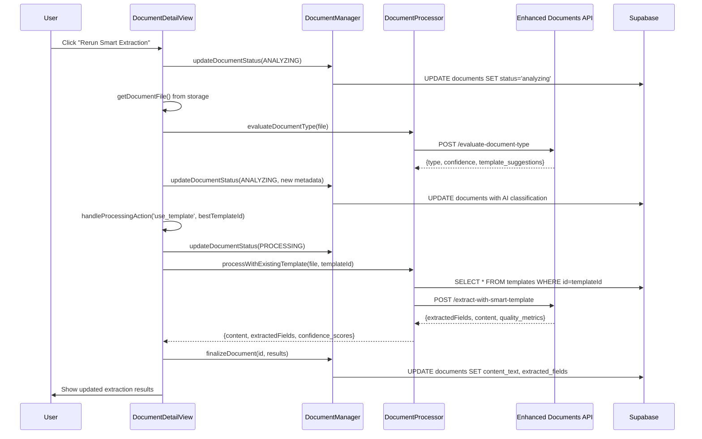

# "Rerun Smart Extraction" - Complete Flow Analysis

## 🎯 What It Does

When a user clicks **"Rerun Smart Extraction"** button on a document detail page, the system:
1. **Re-evaluates** the document type (in case AI classification improves)
2. **Gets fresh template suggestions** from the database
3. **Automatically selects** the best matching template
4. **Extracts fields** using the template's smart variables
5. **Updates** the document with new extraction results

## 📊 Complete Flow Diagram



## 🔧 Code Flow (Step by Step)

### Step 1: User Clicks Button
**Location**: `DocumentDetailView.tsx:1547-1554`

```tsx
<Button onClick={() => handleRerunExtraction()}>
  <Sparkles className="w-4 h-4 mr-2" />
  Rerun Smart Extraction
</Button>
```

### Step 2: Update Status to "Analyzing"
**Location**: `DocumentDetailView.tsx:438-453`

```typescript
const handleRerunExtraction = async () => {
  setIsProcessing(true);

  // Mark document as "analyzing" for re-evaluation
  await documentManager.updateDocumentStatus(documentId, {
    status: DocumentStatus.ANALYZING,
    metadata: {
      ...document.metadata,
      rerun_extraction: true,
      rerun_timestamp: new Date().toISOString()
    }
  });
```

**What Happens**:
- UI shows processing indicator
- Document status → "analyzing"
- Metadata flag set: `rerun_extraction: true`

### Step 3: Get Document File from Storage
**Location**: `DocumentDetailView.tsx:455, 336-358`

```typescript
const file = await getDocumentFile();

// Helper function
const getDocumentFile = async (): Promise<File> => {
  const { supabase } = await import('@/lib/supabase');
  const { data, error } = await supabase.storage
    .from('documents')
    .download(document.file_path);

  return new File([data], document.name, { type: document.file_type });
};
```

**What Happens**:
- Downloads original file from Supabase Storage
- Converts blob to File object
- Preserves original filename and MIME type

### Step 4: Re-Evaluate Document Type
**Location**: `DocumentDetailView.tsx:457-458`

```typescript
const evaluationResult = await documentProcessor.evaluateDocumentType(file);
```

**Endpoint**: `POST /api/enhanced-documents/evaluate-document-type`

**What It Does**:
1. Extracts first 5000 characters of document
2. Runs pattern matching against keywords
3. Queries database for matching templates
4. Returns classification + template suggestions

**Response**:
```json
{
  "document_info": {
    "filename": "Stucco Contract V1.pdf",
    "file_size": 248071,
    "mime_type": "application/pdf"
  },
  "type_evaluation": {
    "primary_type": "contract",
    "confidence": 0.75,
    "detection_method": "simple_pattern_matching"
  },
  "template_suggestions": [
    {
      "template_id": 4,
      "template_name": "Contract Key Terms Extractor",
      "match_score": 0.70,
      "category": "legal",
      "field_count": 7
    }
  ]
}
```

**Backend Location**: `document-processor/app/routers/enhanced_documents.py:665`

### Step 5: Update Document with New Classification
**Location**: `DocumentDetailView.tsx:461-476`

```typescript
await documentManager.updateDocumentStatus(documentId, {
  status: DocumentStatus.ANALYZING,
  metadata: {
    document_type: evaluationResult.type_evaluation.primary_type,
    type_confidence: evaluationResult.type_evaluation.confidence,
    ai_classification: {
      primary_category: evaluationResult.type_evaluation.primary_type,
      confidence_score: evaluationResult.type_evaluation.confidence,
      detection_method: evaluationResult.type_evaluation.detection_method
    },
    template_suggestions: evaluationResult.template_suggestions,
    rerun_extraction: true,
    rerun_timestamp: new Date().toISOString()
  }
});
```

**Database Update**:
```sql
UPDATE documents
SET metadata = jsonb_set(
  metadata,
  '{document_type}',
  '"contract"'
)
WHERE id = 17;
```

### Step 6: Auto-Select Best Template
**Location**: `DocumentDetailView.tsx:478-484`

```typescript
if (evaluationResult.template_suggestions.length > 0) {
  const bestTemplate = evaluationResult.template_suggestions[0];
  await handleProcessingAction('use_template', bestTemplate.template_id);
} else {
  await handleProcessingAction('generate_template');
}
```

**Logic**:
- If suggestions exist → Use best match (highest score)
- If no suggestions → Generate new template

### Step 7: Process with Selected Template
**Location**: `DocumentDetailView.tsx:360-380`

```typescript
const handleProcessingAction = async (action, templateId) => {
  await documentManager.updateDocumentStatus(documentId, {
    status: DocumentStatus.PROCESSING,
    metadata: {
      processing_method: 'template_guided',
      template_id: templateId
    }
  });

  const file = await getDocumentFile();
  const result = await documentProcessor.processWithExistingTemplate(file, templateId);
```

### Step 8: Fetch Template from Database
**Location**: `document-processor-enhanced.ts:1350-1386`

```typescript
async processWithExistingTemplate(file: File, templateId: number) {
  const { supabase } = await import('@/lib/supabase');

  // Query Supabase for template
  const { data: template } = await supabase
    .from('templates')
    .select('*')
    .eq('id', templateId)
    .single();

  // Transform to SmartTemplate format
  const smartTemplate: SmartTemplate = {
    ...template,
    smart_variables: template.variables || [],
    extraction_rules: template.extraction_rules || []
  };

  return this.processDocumentWithTemplate(file, smartTemplate);
}
```

**Database Query**:
```sql
SELECT id, name, category, description,
       variables as smart_variables,
       extraction_rules, template_content
FROM templates
WHERE id = 4
  AND (is_public = true OR created_by = 'user-id');
```

### Step 9: Extract Fields with Smart Template
**Location**: `document-processor-enhanced.ts:433-534`

```typescript
async processDocumentWithTemplate(file: File, template: SmartTemplate) {
  const formData = new FormData();
  formData.append('file', file);
  formData.append('template_data', JSON.stringify({
    id: template.id,
    name: template.name,
    smart_variables: template.smart_variables,
    extraction_rules: template.extraction_rules,
    confidence_threshold: 0.7
  }));

  const response = await fetch(
    `${this.enhancedBaseUrl}/extract-with-smart-template`,
    { method: 'POST', body: formData }
  );

  const result = await response.json();
  return this.transformSmartTemplateResponse(result, file, template);
}
```

**Endpoint**: `POST /api/enhanced-documents/extract-with-smart-template`

**Backend Location**: `document-processor/app/routers/enhanced_documents.py:733`

**Request**:
```json
{
  "file": <binary PDF data>,
  "template_data": {
    "id": 4,
    "name": "Contract Key Terms Extractor",
    "smart_variables": [
      {
        "id": "contract_type",
        "name": "Contract Type",
        "type": "text",
        "extraction_hints": ["agreement", "contract type"]
      },
      {
        "id": "contract_value",
        "name": "Contract Value",
        "type": "currency",
        "extraction_hints": ["value", "amount", "total"]
      }
    ],
    "confidence_threshold": 0.7
  }
}
```

**Response**:
```json
{
  "extracted_fields": {
    "contract_type": {
      "value": "Residential Stucco Service Agreement",
      "confidence": 0.85,
      "source_text": "...residential stucco services...",
      "location": { "page": 1, "position": 120 }
    },
    "contract_value": {
      "value": "$15,000",
      "confidence": 0.92,
      "source_text": "Total Contract Value: $15,000",
      "location": { "page": 1, "position": 450 }
    }
  },
  "content": {
    "text": "## PROPOSAL AND CONTRACT..."
  },
  "quality_metrics": {
    "extraction_quality": 0.88,
    "fields_extracted": 7,
    "avg_confidence": 0.87
  }
}
```

### Step 10: Finalize Document with Results
**Location**: `DocumentDetailView.tsx:398-420`

```typescript
await documentManager.finalizeDocument(documentId, {
  content_text: result?.content || '',
  extracted_fields: result?.extractedFields,
  processing_method: 'template_guided',
  quality_metrics: result?.quality_metrics,
  metadata: {
    original_content: result?.content,
    extraction_result: {
      extracted_values: result?.extractedFields || {},
      confidence_scores: result?.confidence_scores || {}
    }
  }
});
```

**Database Update**:
```sql
UPDATE documents
SET
  content_text = '## PROPOSAL AND CONTRACT...',
  extracted_fields = jsonb_build_object(
    'contract_type', jsonb_build_object('value', 'Residential Stucco Service Agreement', 'confidence', 0.85),
    'contract_value', jsonb_build_object('value', '$15,000', 'confidence', 0.92)
  ),
  metadata = jsonb_set(metadata, '{processing_method}', '"template_guided"'),
  processing_status = 'completed',
  updated_at = NOW()
WHERE id = 17;
```

### Step 11: Refresh UI
**Location**: `DocumentDetailView.tsx:422-424`

```typescript
await queryClient.invalidateQueries({ queryKey: ['processedDocuments'] });
await refetch();
```

**What Happens**:
- React Query cache invalidated
- Document re-fetched from database
- UI updates with new extracted fields
- Processing indicator hidden

## 🔗 Endpoints Used

### 1. Evaluate Document Type
- **Endpoint**: `POST /api/enhanced-documents/evaluate-document-type`
- **Backend**: `enhanced_documents.py:665`
- **Service**: `document_evaluator.py:76`
- **Purpose**: AI classification + template matching
- **Response Time**: 2-5 seconds

### 2. Extract with Smart Template
- **Endpoint**: `POST /api/enhanced-documents/extract-with-smart-template`
- **Backend**: `enhanced_documents.py:733`
- **Service**: `smart_template_extractor.py`
- **Purpose**: Field extraction using template definitions
- **Response Time**: 5-15 seconds (depends on AI provider)

### 3. Supabase Queries
- **Get Template**: `SELECT * FROM templates WHERE id = ?`
- **Update Document**: `UPDATE documents SET ...`
- **Download File**: `storage.from('documents').download(path)`

## 💡 Key Differences from Initial Upload

| Aspect | Initial Upload | Rerun Extraction |
|--------|---------------|------------------|
| **Trigger** | User uploads new file | User clicks "Rerun" button |
| **File Source** | Uploaded from user's device | Downloaded from Supabase Storage |
| **Template Selection** | User chooses from suggestions | Auto-selects best match |
| **Status Flow** | uploaded → analyzing → processing → completed | analyzing → processing → completed |
| **Content Extraction** | Done during upload (after our fix) | Re-extracts from stored file |
| **Purpose** | First-time processing | Improve results with better template |

## 🎯 Use Cases for "Rerun Smart Extraction"

### When to Use It:

1. **Better Template Available** - New template added to database that matches better
2. **Initial Extraction Failed** - Low confidence scores or missing fields
3. **Wrong Template Used** - User realizes document is different type
4. **Template Updated** - Template fields or extraction rules improved
5. **AI Model Improved** - Backend AI classification enhanced

### Example Scenario:

```
Initial Upload:
- Document classified as "business_report" (65% confidence)
- Used generic "Business Report Template"
- Extracted 3 out of 7 expected fields

After Adding "Contract Template" to Database:
- User clicks "Rerun Smart Extraction"
- Document re-classified as "contract" (85% confidence)
- Auto-selects "Contract Key Terms Extractor"
- Extracts all 7 contract-specific fields
- Higher confidence scores (avg 0.87 vs 0.65)
```

## ⚙️ Configuration

### Timeouts
```typescript
// Document evaluation
timeout: 30000  // 30 seconds

// Smart template extraction
timeout: 150000  // 2.5 minutes (allows for LLM processing)
```

### Confidence Thresholds
```typescript
// Template matching
min_match_confidence: 0.7  // 70% to suggest template

// Field extraction
confidence_threshold: 0.7  // 70% to accept field value
```

### Auto-Selection Logic
```typescript
// Rerun always uses best match
const bestTemplate = evaluationResult.template_suggestions[0];

// vs Initial upload (user chooses)
<TemplateSelector suggestions={evaluationResult.template_suggestions} />
```

## 🚀 Performance Metrics

**Total Time**: 7-20 seconds
- Document download: 0.5-1s
- Type evaluation: 2-5s
- Database query: 0.1s
- Template extraction: 5-15s
- Database update: 0.2s

**API Calls**: 3-4
1. Supabase: Download file
2. Backend: Evaluate document type
3. Supabase: Fetch template
4. Backend: Extract with smart template
5. Supabase: Update document

## 📝 Database Changes

### Documents Table
```sql
-- Before Rerun
SELECT id, processing_status, content_text, extracted_fields
FROM documents WHERE id = 17;

-- Results:
-- processing_status: 'uploaded'
-- content_text: '## PROPOSAL AND CONTRACT...'
-- extracted_fields: null (or incomplete)

-- After Rerun
-- processing_status: 'completed'
-- content_text: '## PROPOSAL AND CONTRACT...' (same)
-- extracted_fields: { contract_type: {...}, contract_value: {...}, ... } (populated!)
```

### Metadata Updates
```json
{
  "rerun_extraction": true,
  "rerun_timestamp": "2025-12-09T20:30:00Z",
  "document_type": "contract",
  "type_confidence": 0.85,
  "processing_method": "template_guided",
  "template_id": 4,
  "template_name": "Contract Key Terms Extractor",
  "extraction_quality": 0.88
}
```

## Summary

"Rerun Smart Extraction" is a **complete re-processing workflow** that:
- Fetches the stored file
- Re-analyzes document type
- Auto-selects the best matching template
- Re-extracts all fields with updated AI
- Updates database with improved results

It's essentially running the **smart upload flow again**, but with:
- Auto-selection instead of manual choice
- Metadata flag showing it's a rerun
- Updated AI classification from improved backend
