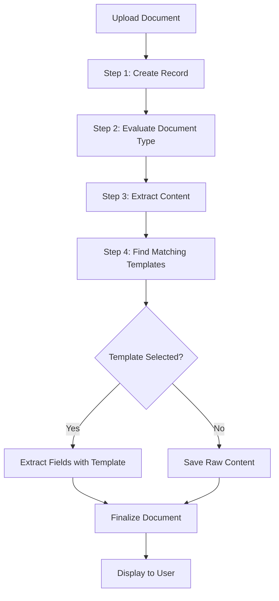

# Template Matching & Feature Extraction - Current State Analysis

## 🎯 Executive Summary

The **document upload endpoint** (`/documents/upload`) currently provides:
1. ✅ **Document content extraction** - Full text via Docling (working after our fix)
2. ✅ **Document type classification** - AI-powered via pattern matching
3. ✅ **Template suggestions** - Database-backed smart matching
4. ✅ **Template-guided extraction** - Field extraction using smart templates
5. ❌ **AI-enhanced extraction** - Not yet implemented

## 📊 Current Upload Flow Architecture

### What Happens When You Upload a Document



### Current Implementation Details

#### 1. Document Type Evaluation ✅ IMPLEMENTED
**Endpoint**: `POST /api/enhanced-documents/evaluate-document-type`

**Location**:
- Backend: `document-processor/app/services/document_evaluator.py:76`
- Frontend: `document-processor-enhanced.ts:1367`

**What It Does**:
```typescript
// Analyzes document to determine type
evaluateDocumentType(file) → {
  document_info: {
    filename: "Stucco Contract V1.pdf",
    file_size: 248071,
    mime_type: "application/pdf"
  },
  type_evaluation: {
    primary_type: "contract",  // AI classified
    confidence: 0.75,
    detection_method: "simple_pattern_matching"
  },
  template_suggestions: [
    {
      template_id: 4,
      template_name: "Contract Key Terms Extractor",
      match_score: 0.524,
      category: "legal",
      field_count: 7
    }
  ]
}
```

**How It Works**:
1. Extracts first 5000 characters from document
2. Runs pattern matching against keywords:
   - Contract: "agreement", "terms", "party", "whereas"
   - Invoice: "invoice", "amount", "due", "payment"
   - Receipt: "receipt", "purchase", "transaction"
3. Calculates confidence score based on keyword matches
4. Calls template matching service for suggestions

**Algorithm** (`document_evaluator.py:196-223`):
```python
def _calculate_pattern_score(content, keywords):
    matches = sum(1 for keyword in keywords if keyword in content.lower())
    score = min(matches / len(keywords), 1.0)
    return score
```

#### 2. Template Matching Service ✅ IMPLEMENTED
**Location**: `document-processor/app/services/template_matching_service.py`

**What It Does**:
```python
find_matching_templates(
    document_type="contract",
    content_keywords=["agreement", "terms", "payment"],
    min_confidence=0.5
) → [
    {
        template_id: 4,
        template_name: "Contract Key Terms Extractor",
        match_score: 0.7,
        category: "legal",
        field_count: 7,
        usage_count: 52
    }
]
```

**Scoring Algorithm** (lines 82-100):
```python
async def _calculate_template_score(template, document_type, keywords):
    # 1. Category match (40% weight)
    category_score = check_category_match(template.category, document_type)

    # 2. Field coverage (30% weight)
    field_score = calculate_field_coverage(template.fields, keywords)

    # 3. Content similarity (10% weight)
    content_score = keyword_overlap(template.description, keywords)

    # 4. Usage popularity (10% weight)
    popularity_score = normalize_usage_count(template.usage_count)

    # 5. Success rate (10% weight)
    success_score = template.success_rate or 0.75

    total_score = (
        category_score * 0.4 +
        field_score * 0.3 +
        content_score * 0.1 +
        popularity_score * 0.1 +
        success_score * 0.1
    )

    return total_score
```

**Database Integration**:
- Queries `smart_templates` table from Supabase
- Filters for `is_public = true`
- Orders by `usage_count DESC`
- Caches results for 5 minutes via `TemplateCache`
- Returns top 5 matches

#### 3. Content Extraction ✅ IMPLEMENTED (Just Fixed)
**Endpoint**: `POST /documents/upload` → async job polling

**Location**: `document-processor-enhanced.ts:595-632`

**What It Does**:
1. Uploads file to `/documents/upload`
2. Receives `job_id` for async processing
3. Polls `/documents/result/{job_id}` every 1 second
4. Waits for status = "completed"
5. Returns full extracted text content

**Processing Methods**:
- **PDFs**: Docling library (IBM's document processor)
- **Images**: OCR via Tesseract
- **Word/Excel**: python-docx, openpyxl
- **Text files**: Direct reading

**Output**:
```json
{
  "status": "completed",
  "content": {
    "text": "## PROPOSAL AND CONTRACT...",  // 2241 characters
    "markdown": "...",
    "layout_info": { "headings": [...], "tables": [...] }
  },
  "metadata": {
    "title": "Stucco Contract V1",
    "author": "Unknown",
    "page_count": 1
  },
  "processing_time": 3.58
}
```

#### 4. Template-Guided Extraction ✅ IMPLEMENTED
**Endpoint**: `POST /api/enhanced-documents/extract-with-smart-template`

**Location**: `enhanced_documents.py:733`

**What It Does**:
```python
# User selects "Contract Key Terms Extractor" template
extract_with_smart_template(
    file=pdf_file,
    template_id=4,
    confidence_threshold=0.7
) → {
    extracted_fields: {
        "contract_type": {
            value: "Service Agreement",
            confidence: 0.85,
            source_text: "...residential stucco services..."
        },
        "parties": {
            value: "Nicholas Yeager and Contractor",
            confidence: 0.92
        },
        "contract_value": {
            value: "$15,000",
            confidence: 0.88
        }
    },
    quality_metrics: {
        extraction_quality: 0.85,
        fields_extracted: 7,
        avg_confidence: 0.88
    }
}
```

**Extraction Methods**:
1. **Regex Fallback**: Pattern matching for structured fields
2. **AI Enhancement**: GPT-4 for complex fields (if Azure OpenAI configured)
3. **Hybrid**: Combines both for best results

**Smart Variable Structure** (from `smart_templates.smart_variables`):
```json
{
  "id": "contract_value",
  "name": "Contract Value",
  "type": "currency",
  "description": "Total contract value",
  "extraction_hints": ["value", "amount", "total cost"],
  "regex_pattern": "\\$[\\d,]+\\.?\\d*"
}
```

## 🆕 What Can We Add?

### Enhancement 1: AI-Powered Field Extraction (Azure OpenAI)
**Status**: Framework exists but not fully utilized

**Current**: Regex patterns extract fields
**Proposed**: Use Azure OpenAI for complex extraction

**Implementation**:
```python
# Add to extract_with_smart_template endpoint
if azure_openai_enabled:
    for field in template.smart_variables:
        if field.requires_ai:  # Complex fields like "findings", "recommendations"
            ai_prompt = f"""
            Extract the {field.name} from this document.
            Description: {field.description}
            Hints: {field.extraction_hints}

            Document text:
            {document_content}

            Return only the extracted value.
            """
            extracted_value = await azure_openai_client.complete(ai_prompt)
```

**Benefits**:
- Handles unstructured fields better
- Understands context and nuance
- Adapts to document variations

**Example Use Cases**:
- Medical reports: Extract "key findings" and "recommendations"
- Contracts: Extract "payment terms" and "termination clauses"
- Resumes: Extract "work experience summary" and "skills"

### Enhancement 2: Confidence-Based Field Validation
**Status**: Partially implemented

**Current**: Returns confidence scores but doesn't act on them
**Proposed**: Flag low-confidence fields for human review

**Implementation**:
```typescript
interface ExtractedField {
  value: string;
  confidence: number;
  needs_review: boolean;  // ← NEW
  review_reason?: string;  // ← NEW
}

// In processing logic
if (field.confidence < 0.7) {
  field.needs_review = true;
  field.review_reason = "Low confidence extraction - please verify";
}
```

**UI Enhancement**:
```tsx
<FieldDisplay field={extractedField}>
  {field.needs_review && (
    <Badge variant="warning">
      Needs Review: {field.review_reason}
    </Badge>
  )}
</FieldDisplay>
```

### Enhancement 3: Template Auto-Selection
**Status**: Not implemented

**Current**: User must click "Use Template" button
**Proposed**: Auto-apply template if high confidence match

**Implementation**:
```typescript
// In DocumentUploadPage.tsx after evaluation
if (evaluationResult.template_suggestions.length > 0) {
  const bestMatch = evaluationResult.template_suggestions[0];

  if (bestMatch.match_score >= 0.85) {  // High confidence threshold
    console.log('🎯 Auto-selecting template:', bestMatch.template_name);

    // Automatically process with best matching template
    await handleActionSelect({
      type: 'use_template',
      template_id: bestMatch.template_id,
      template_name: bestMatch.template_name
    });

    return; // Skip showing suggestions, go directly to results
  }
}

// Otherwise, show suggestions for user to choose
```

**Benefits**:
- Faster processing for obvious matches
- Reduces user clicks
- Better UX for common document types

**Safety**: Only auto-select if confidence > 85% to avoid errors

### Enhancement 4: Multi-Document Batch Processing
**Status**: Backend supports it, frontend doesn't

**Current**: Upload one document at a time
**Proposed**: Upload multiple documents simultaneously

**Backend Endpoint**: `POST /api/enhanced-documents/batch-process-with-ai` (already exists!)

**Frontend Implementation**:
```tsx
// Add to DocumentUploadPage.tsx
const handleMultipleFileSelect = async (files: File[]) => {
  const formData = new FormData();
  files.forEach(file => formData.append('files', file));

  const response = await fetch(
    'http://localhost:8090/api/enhanced-documents/batch-process-with-ai',
    { method: 'POST', body: formData }
  );

  const result = await response.json();
  // result.batch_statistics: { total_files: 10, successful_count: 9, ... }
  // result.results: Array of individual processing results
};
```

**UI Enhancement**:
- Drag & drop multiple files
- Progress bar showing batch completion
- Individual status for each document
- Bulk template assignment option

### Enhancement 5: Template Performance Analytics
**Status**: Database columns exist but not used

**Current**: Templates have `usage_count` but no quality metrics
**Proposed**: Track extraction success rates and field confidence

**Database Schema** (already in migration):
```sql
-- These columns exist but aren't populated
ALTER TABLE smart_templates ADD COLUMN IF NOT EXISTS success_rate FLOAT DEFAULT 0.0;
ALTER TABLE smart_templates ADD COLUMN IF NOT EXISTS avg_extraction_time_ms INTEGER;
ALTER TABLE smart_templates ADD COLUMN IF NOT EXISTS last_used_at TIMESTAMP;
```

**Analytics Implementation**:
```python
# After successful extraction
async def record_template_usage(template_id, extraction_result):
    # Calculate quality metrics
    avg_confidence = mean([field.confidence for field in extraction_result.fields])
    success = avg_confidence >= 0.7

    # Update template statistics
    await db.execute("""
        UPDATE smart_templates
        SET usage_count = usage_count + 1,
            success_rate = (success_rate * usage_count + {success}) / (usage_count + 1),
            avg_extraction_time_ms = (avg_extraction_time_ms * usage_count + {time}) / (usage_count + 1),
            last_used_at = NOW()
        WHERE id = {template_id}
    """)
```

**UI Dashboard**:
```tsx
<TemplateCard template={template}>
  <div className="stats">
    <Stat label="Success Rate" value={`${template.success_rate * 100}%`} />
    <Stat label="Avg. Time" value={`${template.avg_extraction_time_ms}ms`} />
    <Stat label="Used" value={`${template.usage_count} times`} />
    <Stat label="Last Used" value={formatRelativeTime(template.last_used_at)} />
  </div>
</TemplateCard>
```

### Enhancement 6: Smart Field Suggestions
**Status**: Not implemented

**Proposed**: When viewing extracted results, suggest missing fields

**Implementation**:
```python
# After extraction, analyze what fields are common but missing
common_fields_for_type = {
    'contract': ['effective_date', 'expiration_date', 'parties', 'contract_value', 'payment_terms'],
    'invoice': ['invoice_number', 'date', 'due_date', 'total_amount', 'vendor_name', 'line_items']
}

extracted_field_names = [field.name for field in result.fields]
missing_fields = [
    field for field in common_fields_for_type[document_type]
    if field not in extracted_field_names
]

if missing_fields:
    result.suggestions = {
        'missing_fields': missing_fields,
        'message': f"Consider adding these fields: {', '.join(missing_fields)}"
    }
```

**UI**:
```tsx
{result.suggestions?.missing_fields && (
  <Alert variant="info">
    <AlertTitle>Suggested Fields</AlertTitle>
    <p>These fields are commonly extracted from {documentType} documents:</p>
    <ul>
      {result.suggestions.missing_fields.map(field => (
        <li key={field}>
          {field}
          <Button variant="ghost" onClick={() => addField(field)}>
            Add to Template
          </Button>
        </li>
      ))}
    </ul>
  </Alert>
)}
```

## 📋 Implementation Priority

### High Priority (Do Next)
1. ✅ **Content extraction async polling** - DONE
2. 🔄 **Template auto-selection** - Easy win, big UX improvement
3. 🔄 **Confidence-based review flags** - Improves accuracy

### Medium Priority (Nice to Have)
4. **AI-powered field extraction** - Requires Azure OpenAI budget
5. **Multi-document batch upload** - Backend ready, needs frontend
6. **Template performance analytics** - Improves matching over time

### Low Priority (Future Enhancement)
7. **Smart field suggestions** - Helps users improve templates
8. **A/B testing framework** - For optimizing match algorithms
9. **Machine learning retraining** - Learn from user corrections

## 🔧 Quick Wins You Can Implement Now

### Quick Win 1: Auto-Select High Confidence Templates (15 minutes)
Add to `DocumentUploadPage.tsx` after line 273:

```typescript
// Auto-select template if high confidence match
if (evaluationResult.template_suggestions.length > 0) {
  const bestMatch = evaluationResult.template_suggestions[0];
  if (bestMatch.match_score >= 0.85) {
    console.log('🎯 Auto-selecting high-confidence template');
    setIsProcessing(true);
    await handleActionSelect({
      type: 'use_template',
      template_id: bestMatch.template_id,
      template_name: bestMatch.template_name
    });
    return;
  }
}
```

### Quick Win 2: Show Template Match Scores (10 minutes)
Update `DocumentDetailView.tsx` to display match confidence:

```tsx
{document.metadata?.template_suggestions?.map(suggestion => (
  <Card key={suggestion.template_id}>
    <CardHeader>
      <CardTitle>{suggestion.template_name}</CardTitle>
      <Badge variant={
        suggestion.match_score > 0.8 ? "success" :
        suggestion.match_score > 0.6 ? "warning" : "secondary"
      }>
        {Math.round(suggestion.match_score * 100)}% Match
      </Badge>
    </CardHeader>
  </Card>
))}
```

### Quick Win 3: Track Template Usage (5 minutes)
Add to `extract_with_smart_template` endpoint:

```python
# After successful extraction
await db.execute(
    "UPDATE smart_templates SET usage_count = usage_count + 1, last_used_at = NOW() WHERE id = %s",
    (template_id,)
)
```

## Summary

### What You Currently Have ✅
1. Document type classification (pattern-based)
2. Template matching with confidence scores
3. Template database integration
4. Field extraction with regex + AI framework
5. Content extraction via Docling
6. Async processing with job polling

### What's Missing/Can Be Enhanced 🔄
1. Auto-selection of high-confidence templates
2. AI-enhanced field extraction (Azure OpenAI)
3. Confidence-based review workflows
4. Multi-document batch processing frontend
5. Template performance tracking
6. Smart field suggestions

### Best ROI Improvements
1. **Template auto-selection** - Biggest UX improvement with minimal code
2. **Confidence review flags** - Improves accuracy immediately
3. **Usage tracking** - Enables data-driven template improvements

The infrastructure is solid. Most enhancements are frontend UX improvements or enabling features that already exist in the backend!
