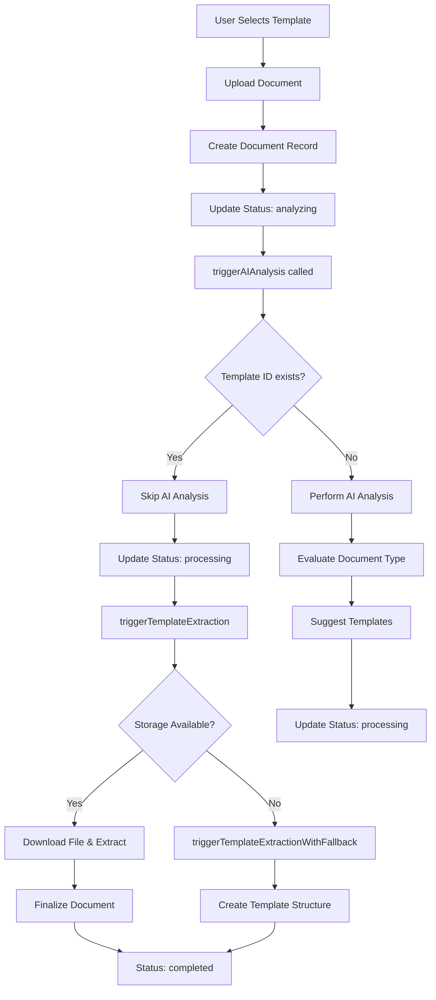
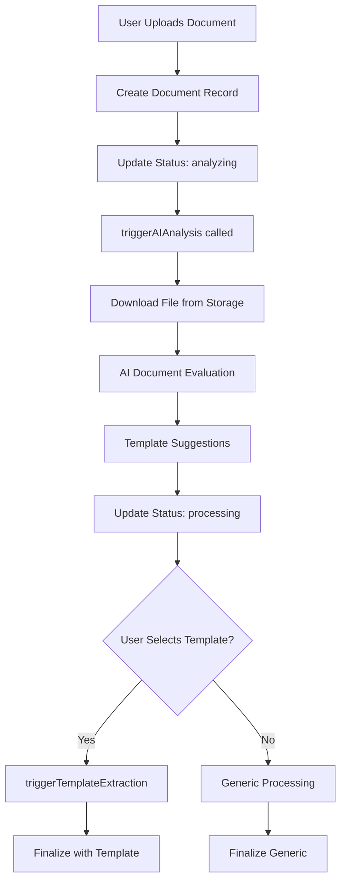

# Document Upload and Template Processing Flow

This document describes the complete flow for document upload and template-based processing in the FetchText system.

## 🔄 **Upload Process Overview**

### **1. Template-Guided Upload Flow**

When a user uploads a document with a pre-selected template:



### **2. Smart Upload Flow (No Template)**

When a user uploads without selecting a template:



## 📋 **Detailed Process Steps**

### **Step 1: Document Creation**

**Location**: `TemplateTestUploader` component or `DocumentUploadPage`

```typescript
const documentRecord = await documentManager.createDocument({
  file,
  uploadSource: UploadSource.TEMPLATE_PROCESSING,
  templateId: templateId, // Pre-selected template
  processingMethod: 'template_guided',
});
```

**What Happens**:
- Creates document record in database
- Uploads file to Supabase storage (with fallback handling)
- Sets initial status to 'uploaded'
- Stores template metadata in `document.metadata.template_id`

### **Step 2: Analysis Trigger**

**Location**: `UnifiedDocumentService.updateDocumentStatus()`

```typescript
await documentManager.updateDocumentStatus(documentRecord.id, {
  status: 'analyzing' as any,
});
```

**What Happens**:
- Changes status to 'analyzing'
- Automatically triggers `triggerAIAnalysis()` via setTimeout
- Timestamp: `analysis_started_at`

### **Step 3: Template Detection & Processing**

**Location**: `UnifiedDocumentService.triggerAIAnalysis()`

#### **3A: Template Pre-Selected (NEW BEHAVIOR)**
```typescript
if (document.metadata?.template_id) {
  console.log('🎯 Document has pre-selected template, skipping AI analysis');
  // Skip AI analysis, go directly to template extraction
  await this.updateDocumentStatus(documentId, {
    status: DocumentStatus.PROCESSING,
    metadata: {
      analysis_skipped: true,
      analysis_skip_reason: 'template_pre_selected',
      template_id: document.metadata.template_id,
    },
  });
  setTimeout(() => this.triggerTemplateExtraction(documentId), 100);
}
```

#### **3B: No Template (AI Analysis)**
```typescript
// Perform AI document evaluation
const evaluation = await documentProcessor.evaluateDocumentType(file);
// Update with suggestions and move to processing
```

### **Step 4: Template Extraction**

**Location**: `UnifiedDocumentService.triggerTemplateExtraction()`

#### **4A: Normal Processing (Storage Available)**
```typescript
// Download file from storage
const fileData = await supabase.storage.from('documents').download(filePath);
// Process with DocumentProcessorEnhanced
const extractionResult = await documentProcessor.processDocumentWithTemplate(file, template);
// Finalize with real extraction results
```

#### **4B: Fallback Processing (Storage Unavailable - NEW)**
```typescript
// Called when storage returns 503 error
await this.triggerTemplateExtractionWithFallback(documentId);
// Creates template structure without file processing
// Finalizes with empty fields but proper template assignment
```

### **Step 5: Document Finalization**

**Location**: `UnifiedDocumentService.finalizeDocument()`

```typescript
await this.finalizeDocument(documentId, {
  content_text: extractionResult.content,
  extracted_fields: extractionResult.extractedFields,
  processing_method: 'smart_template',
  metadata: {
    template_used: template.name,
    field_count: Object.keys(extractionResult.extractedFields).length,
  }
});
```

**Final Status**: `completed`

## 🛠 **Error Handling & Recovery**

### **Storage Errors (503 Service Unavailable)**

**Problem**: Supabase storage returns 503 error
**Solution**: Fallback template processing

```typescript
if (downloadError || !fileData) {
  if (document.metadata?.template_id) {
    console.log('🔄 Storage failed but template selected, attempting fallback');
    await this.triggerTemplateExtractionWithFallback(documentId);
  } else {
    await this.markDocumentFailed(documentId, 'Storage unavailable and no template');
  }
}
```

### **Template Processing Timeout**

**Problem**: Template extraction takes too long
**Solution**: 5-minute timeout with fallback

```typescript
const timeoutPromise = new Promise((_, reject) => {
  setTimeout(() => reject(new Error('Template extraction timeout')), 5 * 60 * 1000);
});
const extractionResult = await Promise.race([extractionPromise, timeoutPromise]);
```

### **Stuck Document Recovery**

**Problem**: Documents stuck in processing
**Solution**: Background monitoring with automatic retry

```typescript
// DocumentProcessingMonitor checks every 2 minutes
// Automatically retries up to 3 times
// Forces retry for stuck documents
```

## 📊 **Status Tracking**

### **Document Status Flow**
```
uploaded → analyzing → processing → completed
                ↓
              failed (if errors occur)
```

### **Metadata Tracking**
```typescript
{
  upload_source: 'template_processing',
  template_id: 3,
  processing_method: 'template_guided',
  uploaded_at: '2025-08-22T04:42:11.489Z',
  analysis_started_at: '2025-08-22T04:42:11.500Z',
  analysis_completed_at: '2025-08-22T04:42:11.600Z',
  processing_started_at: '2025-08-22T04:42:11.700Z',
  processing_completed_at: '2025-08-22T04:42:15.800Z',
  template_used: 'Invoice Template',
  field_count: 5,
  extraction_quality: 0.95
}
```

## 🎯 **Key Improvements Made**

### **1. Template Preservation**
- ✅ Template ID is preserved throughout the entire process
- ✅ Pre-selected templates skip AI analysis
- ✅ Template assignment guaranteed even with storage failures

### **2. Storage Error Resilience**
- ✅ Graceful handling of 503 storage errors
- ✅ Fallback template processing when storage unavailable
- ✅ Document completion with template structure even without file

### **3. Stuck Document Prevention**
- ✅ Automatic timeout handling (5 minutes)
- ✅ Background monitoring for stuck documents
- ✅ Automatic retry up to 3 attempts
- ✅ Manual retry capability via dashboard

### **4. Better Error Messages**
- ✅ Clear indication of processing method used
- ✅ Detailed metadata about failure reasons
- ✅ Storage availability status in metadata

## 🔍 **Debugging Tips**

### **Check Document Status**
```typescript
const document = await UnifiedDocumentService.getDocumentById(documentId);
console.log('Status:', document.processing_status);
console.log('Metadata:', document.metadata);
```

### **Common Issues**
1. **Storage 503 Error**: Normal fallback behavior, template should still be assigned
2. **Missing Template ID**: Check metadata.template_id in document record
3. **Stuck Processing**: Use ProcessingMonitorWidget in dashboard to retry
4. **Analysis Timeout**: Check for network connectivity to document processor

### **Expected Logs for Template Upload**
```
🎯 Document has pre-selected template, skipping AI analysis
🔄 Starting template extraction...
✅ Template extraction completed for document: 34
✅ Document status updated successfully: completed
```

This flow ensures that template-selected uploads work reliably even when storage services are temporarily unavailable, while preserving the template assignment and providing meaningful completion status.