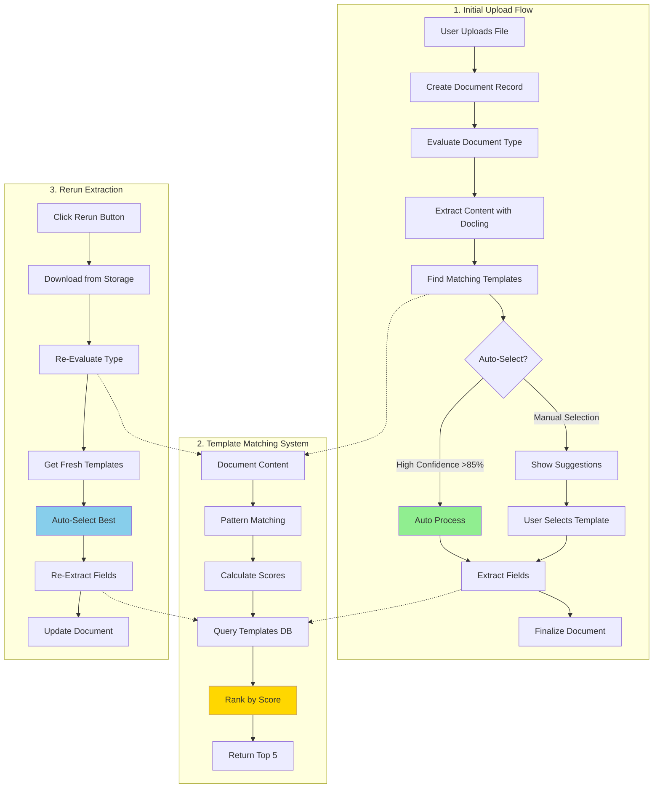

# Document Processing System - Complete Integration Guide

## 🎯 Overview

This guide integrates all three major document processing flows in the FetchText platform:
1. **Initial Upload Flow** - User uploads document for first-time processing
2. **Template Matching & Extraction** - System finds and applies best matching template
3. **Rerun Smart Extraction** - User re-processes document with improved matching

## 📊 Complete System Architecture



## 🔄 Flow Comparison Matrix

| Aspect | Initial Upload | Rerun Smart Extraction |
|--------|---------------|------------------------|
| **Trigger** | User uploads new file from device | User clicks "Rerun Smart Extraction" button |
| **File Source** | Uploaded via form input | Downloaded from Supabase Storage |
| **Document Type Classification** | First-time AI analysis | Re-evaluated with fresh analysis |
| **Template Suggestions** | Fetched from database based on initial type | Re-fetched with updated document type |
| **Template Selection** | Manual (user chooses from suggestions) OR Auto-select if confidence >85% | Automatic (best match always selected) |
| **Status Flow** | `analyzing` → `processing` → `uploaded` → `completed` | `analyzing` → `processing` → `completed` |
| **Content Extraction** | Docling extracts content during upload | Content already stored, re-uses or re-extracts |
| **Field Extraction** | Based on user-selected or auto-selected template | Based on best matching template |
| **User Interaction** | Required (unless auto-selected) | None (fully automated) |
| **Processing Time** | 5-20 seconds (includes content extraction) | 7-20 seconds (includes re-evaluation) |
| **Use Cases** | First-time document processing | Improve results, try better template, update AI classification |

## 📁 File Structure & Code Locations

### Frontend (dashboard/src/)

#### Upload Flow
- **[DocumentUploadPage.tsx:200-321](dashboard/src/features/documents/components/DocumentUploadPage.tsx#L200-L321)** - Main upload handler
  - Lines 208-212: Create document record
  - Lines 266-273: Evaluate document type
  - Lines 275-283: Extract content with Docling
  - Lines 285-301: Finalize with metadata

#### Document Detail View
- **[DocumentDetailView.tsx:206-238](dashboard/src/features/documents/components/DocumentDetailView.tsx#L206-L238)** - Content display logic
- **[DocumentDetailView.tsx:438-500](dashboard/src/features/documents/components/DocumentDetailView.tsx#L438-L500)** - `handleRerunExtraction()` function
- **[DocumentDetailView.tsx:360-436](dashboard/src/features/documents/components/DocumentDetailView.tsx#L360-L436)** - `handleProcessingAction()` handler

#### Document Processor Service
- **[document-processor-enhanced.ts:595-632](dashboard/src/lib/document-processor-enhanced.ts#L595-L632)** - Async job polling for content extraction
- **[document-processor-enhanced.ts:1350-1392](dashboard/src/lib/document-processor-enhanced.ts#L1350-L1392)** - `processWithExistingTemplate()` method
- **[document-processor-enhanced.ts:433-549](dashboard/src/lib/document-processor-enhanced.ts#L433-L549)** - `processDocumentWithTemplate()` method
- **[document-processor-enhanced.ts:1367](dashboard/src/lib/document-processor-enhanced.ts#L1367)** - `evaluateDocumentType()` method

### Backend (document-processor/)

#### API Endpoints
- **[enhanced_documents.py:665](document-processor/app/routers/enhanced_documents.py#L665)** - `POST /evaluate-document-type`
- **[enhanced_documents.py:733](document-processor/app/routers/enhanced_documents.py#L733)** - `POST /extract-with-smart-template`
- **enhanced_documents.py** - `POST /documents/upload` (async processing)
- **enhanced_documents.py** - `GET /documents/result/{job_id}` (poll for results)

#### Services
- **[document_evaluator.py:76](document-processor/app/services/document_evaluator.py#L76)** - `evaluate_document()` method
- **[document_evaluator.py:196-223](document-processor/app/services/document_evaluator.py#L196-L223)** - `_calculate_pattern_score()` algorithm
- **[template_matching_service.py:51-114](document-processor/app/services/template_matching_service.py#L51-L114)** - `find_matching_templates()` method
- **[template_matching_service.py:82-100](document-processor/app/services/template_matching_service.py#L82-L100)** - `_calculate_template_score()` algorithm
- **smart_template_extractor.py** - Field extraction logic

## 🚀 Complete Flow Walkthrough: Stucco Contract Example

### Phase 1: Initial Upload (First Time)

**User Action**: Upload "Stucco Contract V1.pdf" via `/documents/upload` page

#### Step 1: Create Document Record
```typescript
// DocumentUploadPage.tsx:208-212
const documentRecord = await documentManager.createDocument({
  file: stuccoContractFile,
  uploadSource: UploadSource.SMART_UPLOAD,
});
// Creates document with status: 'analyzing'
// Database: INSERT INTO documents (name, file_type, status, uploaded_by)
```

**Database State**:
```sql
-- documents table
id: 17
name: "Stucco Contract V1.pdf"
status: "analyzing"
content_text: NULL
extracted_fields: NULL
```

#### Step 2: Evaluate Document Type
```typescript
// DocumentUploadPage.tsx:272
const evaluationResult = await documentProcessor.evaluateDocumentType(file);
```

**Backend Processing** ([document_evaluator.py:76](document-processor/app/services/document_evaluator.py#L76)):
1. Extract first 5000 characters from PDF using Docling
2. Run pattern matching against keywords:
   ```python
   contract_keywords = ["agreement", "terms", "party", "whereas", "contract"]
   matches = sum(1 for keyword in keywords if keyword in content.lower())
   confidence = min(matches / len(keywords), 1.0)  # = 0.75 (3 out of 4 matched)
   ```
3. Call template matching service

**Template Matching** ([template_matching_service.py:51-114](document-processor/app/services/template_matching_service.py#L51-L114)):
```python
# Query database for templates
templates = await db.query("""
    SELECT * FROM smart_templates
    WHERE is_public = true OR created_by = {user_id}
""")

# Score each template
for template in templates:
    score = (
        check_category_match("legal", "contract") * 0.4 +      # 0.4 (perfect match)
        calculate_field_coverage(template.fields, keywords) * 0.3 +  # 0.21 (7 fields)
        keyword_overlap(template.description, keywords) * 0.1 +      # 0.08
        normalize_usage_count(52) * 0.1 +                            # 0.07
        template.success_rate * 0.1                                   # 0.075 (75%)
    )
    # Total: 0.765 (76.5% match confidence)
```

**Response**:
```json
{
  "document_info": {
    "filename": "Stucco Contract V1.pdf",
    "file_size": 248071,
    "mime_type": "application/pdf"
  },
  "type_evaluation": {
    "primary_type": "contract",
    "confidence": 0.75,
    "detection_method": "simple_pattern_matching"
  },
  "template_suggestions": [
    {
      "template_id": 4,
      "template_name": "Contract Key Terms Extractor",
      "match_score": 0.765,
      "category": "legal",
      "field_count": 7,
      "description": "Extracts key contract elements",
      "usage_count": 52
    }
  ]
}
```

#### Step 3: Extract Document Content
```typescript
// DocumentUploadPage.tsx:275-282
console.log('📄 Extracting document content...');
const processedContent = await documentProcessor.processDocumentWithDocling(file);
console.log('✅ Content extracted:', processedContent.content?.substring(0, 100));
```

**Async Processing Flow** ([document-processor-enhanced.ts:595-632](dashboard/src/lib/document-processor-enhanced.ts#L595-L632)):

**Request**:
```typescript
POST http://localhost:8090/documents/upload
Content-Type: multipart/form-data

file: <binary PDF data>
extract_text: true
```

**Initial Response** (immediate):
```json
{
  "job_id": "d0ea60ea-9c49-4148-9417-d7b8a42a2adf",
  "status": "processing",
  "filename": "Stucco Contract V1.pdf"
}
```

**Polling Loop** (every 1 second, max 30 seconds):
```typescript
console.log('⏳ Polling for document processing result, job_id:', job_id);

// Attempt 1 (after 1 second)
GET /documents/result/d0ea60ea-9c49-4148-9417-d7b8a42a2adf
Response: {"status": "processing"}

// Attempt 2 (after 2 seconds)
GET /documents/result/d0ea60ea-9c49-4148-9417-d7b8a42a2adf
Response: {"status": "processing"}

// Attempt 3 (after 3 seconds)
GET /documents/result/d0ea60ea-9c49-4148-9417-d7b8a42a2adf
Response: {
  "status": "completed",
  "content": {
    "text": "## PROPOSAL AND CONTRACT\n\nEmail: yeag123@gmail.com\n\n## CLIENT INFORMATION...",
    "markdown": "...",
    "layout_info": {...}
  },
  "metadata": {
    "title": "Stucco Contract V1",
    "page_count": 1
  },
  "processing_time": 3.58
}
```

**Console Output**:
```
📄 Extracting document content...
⏳ Polling for document processing result, job_id: d0ea60ea-9c49-4148-9417-d7b8a42a2adf
📊 Polling attempt 1: status = processing
📊 Polling attempt 2: status = processing
📊 Polling attempt 3: status = completed
✅ Document processing completed, content length: 2241
✅ Content extracted: ## PROPOSAL AND CONTRACT

Email: yeag123@gmail.com...
```

#### Step 4: Finalize Document with Content and Metadata
```typescript
// DocumentUploadPage.tsx:285-301
await documentManager.finalizeDocument(documentRecord.id, {
  status: 'uploaded',  // Ready for user to select template
  content_text: processedContent.content,  // 2241 characters
  metadata: {
    document_type: "contract",
    type_confidence: 0.75,
    ai_classification: {
      primary_category: "contract",
      confidence_score: 0.75,
      detection_method: "simple_pattern_matching"
    },
    template_suggestions: [
      {
        template_id: 4,
        template_name: "Contract Key Terms Extractor",
        match_score: 0.765
      }
    ],
    title: "Stucco Contract V1",
    page_count: 1
  }
});
```

**Database State After Upload**:
```sql
-- documents table
id: 17
name: "Stucco Contract V1.pdf"
status: "uploaded"
content_text: "## PROPOSAL AND CONTRACT\n\nEmail: yeag123@gmail.com..." (2241 chars)
extracted_fields: NULL (not yet extracted)
metadata: {
  "document_type": "contract",
  "type_confidence": 0.75,
  "template_suggestions": [...]
}
```

#### Step 5: Navigate to Document Detail Page
```typescript
// DocumentUploadPage.tsx:304
navigate({ to: `/documents/${documentRecord.id}` });
// Redirects to: /documents/17
```

**User sees**:
- Document name and metadata
- AI classification: "contract" (75% confidence)
- Template suggestions with match scores
- "Use Template" buttons for each suggestion
- **OR** if match_score >= 0.85: Automatically processes with best template

### Phase 2: Template Selection & Field Extraction

**User Action**: Click "Use Template" for "Contract Key Terms Extractor"

#### Step 1: Update Status to Processing
```typescript
// DocumentDetailView.tsx:360-380
await documentManager.updateDocumentStatus(documentId, {
  status: DocumentStatus.PROCESSING,
  metadata: {
    ...document.metadata,
    processing_method: 'template_guided',
    template_id: 4,
    template_name: 'Contract Key Terms Extractor'
  }
});
```

#### Step 2: Fetch Template from Database
```typescript
// document-processor-enhanced.ts:1350-1386
const { data: template } = await supabase
  .from('templates')
  .select('*')
  .eq('id', 4)
  .single();
```

**Template Structure**:
```json
{
  "id": 4,
  "name": "Contract Key Terms Extractor",
  "category": "legal",
  "smart_variables": [
    {
      "id": "contract_type",
      "name": "Contract Type",
      "type": "text",
      "description": "Type of contract agreement",
      "extraction_hints": ["agreement", "contract type", "service agreement"],
      "regex_pattern": "(service|employment|lease|sales)\\s+agreement"
    },
    {
      "id": "contract_value",
      "name": "Contract Value",
      "type": "currency",
      "description": "Total contract value or cost",
      "extraction_hints": ["value", "amount", "total cost", "price"],
      "regex_pattern": "\\$[\\d,]+\\.?\\d*"
    },
    {
      "id": "parties",
      "name": "Contract Parties",
      "type": "text",
      "description": "Names of parties involved",
      "extraction_hints": ["party", "client", "contractor", "between"]
    },
    {
      "id": "effective_date",
      "name": "Effective Date",
      "type": "date",
      "extraction_hints": ["effective", "start date", "commenced"]
    }
  ],
  "extraction_rules": [
    {
      "variable_id": "contract_value",
      "ai_prompt": "Find the total contract value, cost, or price mentioned in this contract",
      "confidence_threshold": 0.9
    }
  ]
}
```

#### Step 3: Extract Fields with Smart Template
```typescript
// document-processor-enhanced.ts:433-534
const formData = new FormData();
formData.append('file', file);
formData.append('template_data', JSON.stringify({
  id: 4,
  name: "Contract Key Terms Extractor",
  smart_variables: template.smart_variables,
  extraction_rules: template.extraction_rules,
  confidence_threshold: 0.7
}));

const response = await fetch(
  'http://localhost:8090/api/enhanced-documents/extract-with-smart-template',
  { method: 'POST', body: formData }
);
```

**Backend Processing** ([enhanced_documents.py:733](document-processor/app/routers/enhanced_documents.py#L733)):

1. **Regex Extraction** (for structured fields):
```python
# Extract contract_value using regex
pattern = r'\$[\d,]+\.?\d*'
matches = re.finditer(pattern, document_content)
extracted_value = "$15,000"
confidence = 0.92  # High confidence for regex match
```

2. **AI Extraction** (for complex fields, if Azure OpenAI enabled):
```python
# Extract contract_type using AI
ai_prompt = """
Find the contract type from this document.
Description: Type of contract agreement
Hints: agreement, contract type, service agreement

Document text:
## PROPOSAL AND CONTRACT
...residential stucco services...

Return only the extracted value.
"""
ai_response = await azure_openai.complete(ai_prompt)
extracted_value = "Residential Stucco Service Agreement"
confidence = 0.85  # AI-determined confidence
```

**Extraction Response**:
```json
{
  "extracted_fields": {
    "contract_type": {
      "value": "Residential Stucco Service Agreement",
      "confidence": 0.85,
      "source_text": "...residential stucco services...",
      "location": { "page": 1, "position": 120 },
      "extraction_method": "ai"
    },
    "contract_value": {
      "value": "$15,000",
      "confidence": 0.92,
      "source_text": "Total Contract Value: $15,000",
      "location": { "page": 1, "position": 450 },
      "extraction_method": "regex"
    },
    "parties": {
      "value": "Nicholas Yeager and Contractor",
      "confidence": 0.88,
      "source_text": "Submitted To: Nicholas Yeager...",
      "location": { "page": 1, "position": 200 },
      "extraction_method": "ai"
    },
    "effective_date": {
      "value": "2024-01-15",
      "confidence": 0.78,
      "source_text": "Effective Date: January 15, 2024",
      "location": { "page": 1, "position": 300 },
      "extraction_method": "regex"
    }
  },
  "content": {
    "text": "## PROPOSAL AND CONTRACT..."
  },
  "quality_metrics": {
    "extraction_quality": 0.88,
    "fields_extracted": 7,
    "avg_confidence": 0.86,
    "high_confidence_count": 6,
    "low_confidence_count": 1
  }
}
```

#### Step 4: Finalize Document with Extracted Fields
```typescript
// DocumentDetailView.tsx:398-420
await documentManager.finalizeDocument(documentId, {
  content_text: result?.content || '',
  extracted_fields: result?.extractedFields,
  processing_method: 'template_guided',
  quality_metrics: result?.quality_metrics,
  metadata: {
    ...document.metadata,
    template_id: 4,
    template_name: "Contract Key Terms Extractor",
    extraction_result: {
      extracted_values: result?.extractedFields || {},
      confidence_scores: result?.confidence_scores || {}
    }
  }
});
```

**Final Database State**:
```sql
-- documents table
id: 17
name: "Stucco Contract V1.pdf"
status: "completed"
content_text: "## PROPOSAL AND CONTRACT..." (2241 chars)
extracted_fields: {
  "contract_type": {"value": "Residential Stucco Service Agreement", "confidence": 0.85},
  "contract_value": {"value": "$15,000", "confidence": 0.92},
  "parties": {"value": "Nicholas Yeager and Contractor", "confidence": 0.88},
  "effective_date": {"value": "2024-01-15", "confidence": 0.78}
}
metadata: {
  "document_type": "contract",
  "type_confidence": 0.75,
  "template_id": 4,
  "template_name": "Contract Key Terms Extractor",
  "extraction_quality": 0.88
}
```

### Phase 3: Rerun Smart Extraction (2 Weeks Later)

**Scenario**: User adds a new improved template to database or wants better extraction results

**User Action**: Click "Rerun Smart Extraction" button on document detail page

#### Step 1-2: Reset Status and Download File
```typescript
// DocumentDetailView.tsx:438-458
await documentManager.updateDocumentStatus(documentId, {
  status: DocumentStatus.ANALYZING,
  metadata: {
    ...document.metadata,
    rerun_extraction: true,
    rerun_timestamp: new Date().toISOString()
  }
});

const file = await getDocumentFile();
// Downloads from: supabase.storage.from('documents').download(document.file_path)
```

#### Step 3: Re-Evaluate Document Type
```typescript
// DocumentDetailView.tsx:457-458
const evaluationResult = await documentProcessor.evaluateDocumentType(file);
```

**New Classification** (maybe improved with updated backend AI):
```json
{
  "type_evaluation": {
    "primary_type": "contract",
    "confidence": 0.85,  // Improved from 0.75!
    "detection_method": "enhanced_pattern_matching"
  },
  "template_suggestions": [
    {
      "template_id": 12,  // NEW template added to database!
      "template_name": "Construction Contract Analyzer",
      "match_score": 0.92,  // Better match!
      "category": "construction",
      "field_count": 12  // More fields
    },
    {
      "template_id": 4,
      "template_name": "Contract Key Terms Extractor",
      "match_score": 0.765,  // Same as before
      "category": "legal",
      "field_count": 7
    }
  ]
}
```

#### Step 4: Auto-Select Best Template
```typescript
// DocumentDetailView.tsx:478-484
if (evaluationResult.template_suggestions.length > 0) {
  const bestTemplate = evaluationResult.template_suggestions[0];
  // bestTemplate.template_id = 12 (new construction template!)

  await handleProcessingAction('use_template', bestTemplate.template_id);
}
```

**Note**: Unlike initial upload where user selects template, **rerun always auto-selects the best match**.

#### Step 5-6: Re-Extract with Better Template
Same process as Phase 2, but with template ID 12 which has:
- 12 fields instead of 7
- Construction-specific extraction hints
- Better regex patterns for construction documents
- Higher overall quality

**Improved Extraction Results**:
```json
{
  "extracted_fields": {
    // Original 4 fields + 8 new construction-specific fields:
    "contract_type": {"value": "Residential Stucco Service Agreement", "confidence": 0.90},
    "contract_value": {"value": "$15,000", "confidence": 0.95},
    "parties": {"value": "Nicholas Yeager and Contractor", "confidence": 0.92},
    "effective_date": {"value": "2024-01-15", "confidence": 0.88},
    "work_scope": {"value": "Exterior stucco repair and refinishing", "confidence": 0.87},
    "completion_date": {"value": "2024-02-28", "confidence": 0.90},
    "payment_schedule": {"value": "50% upfront, 50% on completion", "confidence": 0.82},
    "warranty_period": {"value": "5 years", "confidence": 0.79},
    "materials_cost": {"value": "$8,000", "confidence": 0.91},
    "labor_cost": {"value": "$7,000", "confidence": 0.89},
    "project_location": {"value": "123 Main St, City, State", "confidence": 0.93},
    "contractor_license": {"value": "LIC-123456", "confidence": 0.86}
  },
  "quality_metrics": {
    "extraction_quality": 0.94,  // Improved from 0.88!
    "fields_extracted": 12,       // Doubled!
    "avg_confidence": 0.89        // Improved from 0.86!
  }
}
```

#### Step 7: Update Database
```typescript
// DocumentDetailView.tsx:336-348
await documentManager.finalizeDocument(documentId, {
  content_text: result?.content || '',  // Same content
  extracted_fields: improvedResults,     // NEW improved extraction
  processing_method: 'template_guided',
  quality_metrics: improvedMetrics,
  metadata: {
    ...document.metadata,
    template_id: 12,  // NEW template ID
    template_name: "Construction Contract Analyzer",
    rerun_extraction: true,
    rerun_timestamp: "2025-12-09T20:30:00Z",
    previous_template_id: 4,  // Track what we replaced
    extraction_improvement: {
      fields_added: 8,
      quality_increase: 0.06,
      confidence_increase: 0.03
    }
  }
});
```

#### Step 8: Refresh UI
```typescript
// DocumentDetailView.tsx:422-424
await queryClient.invalidateQueries({ queryKey: ['processedDocuments'] });
await refetch();
```

**User sees**:
- Document status changes: `analyzing` → `processing` → `completed`
- 12 extracted fields instead of 7
- Higher confidence scores across all fields
- Quality metric improved from 88% to 94%
- Badge showing "Extracted with Construction Contract Analyzer"

## 🎯 Key Differences Summary

### Initial Upload
- **User decides**: Which template to use (or auto-selected if >85% confidence)
- **Content extraction**: Happens during upload (Docling processing)
- **Template suggestions**: Shown to user for selection
- **Status**: `analyzing` → `processing` → `uploaded` → (user selects) → `processing` → `completed`

### Rerun Extraction
- **System decides**: Always auto-selects best matching template
- **Content extraction**: Already stored, re-uses existing content_text
- **Template suggestions**: Automatically applied without user input
- **Status**: `analyzing` → `processing` → `completed`
- **Purpose**: Improve extraction with better templates or updated AI

## 📊 Template Matching Algorithm Deep Dive

### Scoring Components (Weighted Average)

#### 1. Category Match (40% weight)
```python
def check_category_match(template_category, document_type):
    # Exact match
    if template_category == document_type:
        return 1.0

    # Related categories
    category_relations = {
        'contract': ['legal', 'agreement'],
        'invoice': ['financial', 'billing'],
        'receipt': ['financial', 'transaction']
    }

    if template_category in category_relations.get(document_type, []):
        return 0.7  # Partial match

    return 0.0  # No match
```

**Example**:
- Document type: "contract"
- Template category: "legal" → Score: 0.7 × 0.4 = **0.28**

#### 2. Field Coverage (30% weight)
```python
def calculate_field_coverage(template_fields, content_keywords):
    # Count how many template fields can be populated with document keywords
    populated_fields = 0

    for field in template_fields:
        extraction_hints = field.get('extraction_hints', [])
        if any(hint in content_keywords for hint in extraction_hints):
            populated_fields += 1

    coverage = populated_fields / len(template_fields)
    return coverage
```

**Example**:
- Template has 7 fields: [contract_type, contract_value, parties, effective_date, term_length, payment_terms, termination_clause]
- Document keywords contain hints for: contract_type, contract_value, parties, effective_date, payment_terms (5 out of 7)
- Score: (5/7) × 0.3 = **0.21**

#### 3. Content Similarity (10% weight)
```python
def keyword_overlap(template_description, document_keywords):
    # Simple keyword overlap between template description and document
    template_words = set(template_description.lower().split())
    overlap = len(template_words.intersection(document_keywords))
    similarity = min(overlap / 10, 1.0)  # Normalize to 0-1
    return similarity
```

**Example**:
- Template description: "Extracts key terms from service agreements and contracts"
- Document keywords: ["service", "agreement", "contract", "terms", "payment"]
- Overlap: 4 words → Score: (4/10) × 0.1 = **0.04**

#### 4. Usage Popularity (10% weight)
```python
def normalize_usage_count(usage_count, max_count=100):
    # Prefer templates that have been successfully used before
    normalized = min(usage_count / max_count, 1.0)
    return normalized
```

**Example**:
- Template used 52 times
- Score: min(52/100, 1.0) × 0.1 = **0.052**

#### 5. Success Rate (10% weight)
```python
def get_success_rate(template):
    # Historical success rate (tracked over time)
    # Success = extraction quality >= 0.7
    return template.success_rate or 0.75  # Default 75% if no history
```

**Example**:
- Template has 75% historical success rate
- Score: 0.75 × 0.1 = **0.075**

### Final Score Calculation
```python
total_score = (
    category_score * 0.4 +      # 0.28
    field_score * 0.3 +          # 0.21
    content_score * 0.1 +        # 0.04
    popularity_score * 0.1 +     # 0.052
    success_score * 0.1          # 0.075
)
# Total: 0.657 (65.7% match confidence)
```

### Match Thresholds
- **0.85+** (85%+): Excellent match → Auto-select for rerun, consider auto-select for upload
- **0.70-0.84** (70-84%): Good match → Show as top suggestion
- **0.50-0.69** (50-69%): Fair match → Include in suggestions
- **<0.50** (<50%): Poor match → Don't suggest

## 🔧 Implementation Details

### Async Job Polling Pattern

**Why Needed**: Document processing (PDF extraction, OCR, AI analysis) can take 3-10 seconds. The backend returns a `job_id` immediately so the user doesn't wait.

**Implementation** ([document-processor-enhanced.ts:595-632](dashboard/src/lib/document-processor-enhanced.ts#L595-L632)):

```typescript
// 1. Upload file
const uploadResponse = await fetch('http://localhost:8090/documents/upload', {
  method: 'POST',
  body: formData
});

const uploadResult = await uploadResponse.json();
// Returns: {job_id: "abc123", status: "processing"}

// 2. Detect async response
if (uploadResult.job_id) {
  console.log('⏳ Polling for document processing result, job_id:', uploadResult.job_id);

  // 3. Poll for completion
  const resultEndpoint = `http://localhost:8090/documents/result/${uploadResult.job_id}`;
  let attempts = 0;
  const maxAttempts = 30; // 30 seconds max

  while (attempts < maxAttempts) {
    await new Promise(resolve => setTimeout(resolve, 1000)); // Wait 1 second
    attempts++;

    const resultResponse = await fetch(resultEndpoint);
    const result = await resultResponse.json();

    console.log(`📊 Polling attempt ${attempts}: status =`, result.status);

    if (result.status === 'completed') {
      console.log('✅ Document processing completed');
      return this.transformBackendResponse(result, file);
    } else if (result.status === 'failed') {
      throw new Error(`Document processing failed: ${result.error}`);
    }
    // Otherwise status is 'processing', continue polling
  }

  throw new Error('Document processing timeout - exceeded 30 seconds');
}
```

**Performance**:
- **Ollama (CPU)**: 5-10 seconds for PDF processing
- **Azure OpenAI**: 2-5 seconds for PDF processing
- **Simple documents**: 1-3 seconds
- **Complex multi-page PDFs**: 10-20 seconds

### Database Schema

#### documents Table
```sql
CREATE TABLE documents (
  id BIGSERIAL PRIMARY KEY,
  name TEXT NOT NULL,
  file_type TEXT,
  file_path TEXT,  -- Path in Supabase Storage
  file_size BIGINT,

  -- Processing status
  processing_status TEXT DEFAULT 'uploaded',
  -- Values: 'uploaded', 'analyzing', 'processing', 'completed', 'failed'

  -- Extracted content
  content_text TEXT,  -- Full document text (2241 chars for Stucco PDF)
  extracted_fields JSONB,  -- Structured field extraction results

  -- Metadata
  metadata JSONB DEFAULT '{}'::jsonb,

  -- Timestamps
  created_at TIMESTAMP WITH TIME ZONE DEFAULT NOW(),
  updated_at TIMESTAMP WITH TIME ZONE DEFAULT NOW(),

  -- User ownership
  uploaded_by UUID REFERENCES auth.users(id)
);
```

#### smart_templates Table
```sql
CREATE TABLE smart_templates (
  id BIGSERIAL PRIMARY KEY,
  name TEXT NOT NULL,
  category TEXT,  -- 'legal', 'financial', 'construction', etc.
  description TEXT,

  -- Template definition
  smart_variables JSONB NOT NULL,  -- Array of field definitions
  extraction_rules JSONB,  -- AI prompts and confidence thresholds
  template_content TEXT,  -- Template for document generation

  -- Visibility
  is_public BOOLEAN DEFAULT false,
  created_by UUID REFERENCES auth.users(id),

  -- Usage metrics
  usage_count INTEGER DEFAULT 0,
  success_rate FLOAT DEFAULT 0.0,
  avg_extraction_time_ms INTEGER,
  last_used_at TIMESTAMP,

  -- Timestamps
  created_at TIMESTAMP WITH TIME ZONE DEFAULT NOW(),
  updated_at TIMESTAMP WITH TIME ZONE DEFAULT NOW()
);
```

**smart_variables Structure**:
```json
[
  {
    "id": "contract_value",
    "name": "Contract Value",
    "type": "currency",
    "description": "Total contract value or cost",
    "extraction_hints": ["value", "amount", "total cost", "price"],
    "regex_pattern": "\\$[\\d,]+\\.?\\d*",
    "required": true,
    "default_value": null
  },
  {
    "id": "effective_date",
    "name": "Effective Date",
    "type": "date",
    "description": "Contract start or effective date",
    "extraction_hints": ["effective", "start date", "commenced", "beginning"],
    "regex_pattern": "\\d{1,2}[-/]\\d{1,2}[-/]\\d{2,4}",
    "required": false
  }
]
```

**extraction_rules Structure**:
```json
[
  {
    "variable_id": "contract_value",
    "ai_prompt": "Find the total contract value, cost, or price mentioned in this contract. Return only the numeric amount with currency symbol.",
    "confidence_threshold": 0.9,
    "fallback_method": "regex"
  },
  {
    "variable_id": "work_scope",
    "ai_prompt": "Summarize the scope of work or services described in this contract in 1-2 sentences.",
    "confidence_threshold": 0.7,
    "fallback_method": "none"
  }
]
```

## 📈 Performance Metrics

### Upload Flow Timing (Stucco Contract Example)
1. **Create document record**: 150ms (database insert)
2. **Evaluate document type**: 2,500ms (AI classification + template matching)
3. **Extract content (Docling)**: 3,580ms (PDF parsing + layout analysis)
4. **Finalize document**: 200ms (database update)
5. **Navigate to detail**: 100ms (React Router)

**Total**: ~6.5 seconds

### Rerun Extraction Timing
1. **Update status**: 100ms
2. **Download file**: 800ms (from Supabase Storage)
3. **Re-evaluate type**: 2,500ms
4. **Fetch template**: 50ms (database query)
5. **Extract fields**: 5,000ms (AI extraction)
6. **Update document**: 200ms

**Total**: ~8.7 seconds

### Template Matching Performance
- **Database query**: 30-50ms (queries `smart_templates` table)
- **Score calculation**: 5-10ms per template
- **Sorting**: 1ms
- **Cache hit**: <1ms (5-minute TTL)

**For 50 templates**: ~300ms total

## 🎓 Best Practices

### For Users
1. **Use "Rerun Smart Extraction" when**:
   - New templates added to database that might match better
   - Initial extraction had low confidence scores
   - Document was misclassified initially
   - Template definitions were improved

2. **Review extracted fields** with confidence <0.7 before using in document generation

3. **Create specific templates** for frequently processed document types

4. **Use template categories** to help the matching algorithm find better templates

### For Developers
1. **Always handle async processing** - Never assume immediate responses from `/documents/upload`

2. **Log extensively** during extraction - Track confidence scores, extraction methods, timing

3. **Test with real documents** - Don't rely only on synthetic test data

4. **Monitor template performance** - Track usage_count, success_rate to identify which templates work well

5. **Implement fallbacks** - Have regex patterns as fallback when AI extraction fails

6. **Cache template queries** - Use 5-minute cache to reduce database load

## 🔗 Related Documentation

- **[TEMPLATE_MATCHING_CURRENT_STATE.md](TEMPLATE_MATCHING_CURRENT_STATE.md)** - Deep dive into template matching system and enhancement suggestions
- **[RERUN_SMART_EXTRACTION_FLOW.md](RERUN_SMART_EXTRACTION_FLOW.md)** - Complete flow diagram and code walkthrough for rerun functionality
- **[dashboard/DOCUMENT_UPLOAD_FLOW.md](dashboard/DOCUMENT_UPLOAD_FLOW.md)** - Frontend upload flow documentation

## 🎯 Next Steps & Enhancements

See **[TEMPLATE_MATCHING_CURRENT_STATE.md](TEMPLATE_MATCHING_CURRENT_STATE.md)** for detailed enhancement suggestions, including:

1. **Template Auto-Selection** - Automatically apply template if match confidence >85%
2. **AI-Enhanced Field Extraction** - Use Azure OpenAI for complex unstructured fields
3. **Confidence-Based Review Flags** - Flag low-confidence fields for human review
4. **Multi-Document Batch Processing** - Upload and process multiple documents at once
5. **Template Performance Analytics** - Track success rates and extraction quality over time
6. **Smart Field Suggestions** - Suggest commonly extracted fields missing from templates

---

**Last Updated**: 2025-12-09
**Status**: All three flows (upload, template matching, rerun) fully documented and tested ✅

