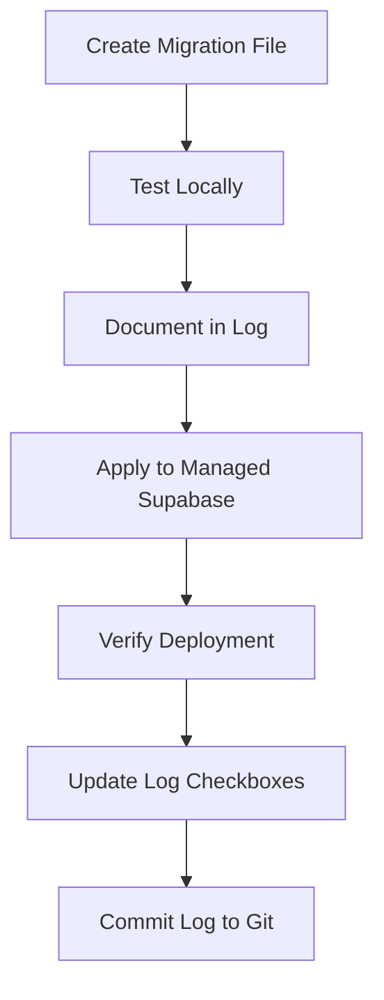

# Production Deployment & Supabase Update Tracking Implementation Plan

> **For Claude:** REQUIRED SUB-SKILL: Use superpowers:executing-plans to implement this plan task-by-task.

**Goal:** Deploy latest feature branch to production (Azure Static Web App + Container App) and establish a tracking system for managed Supabase database updates.

**Architecture:** Multi-step deployment workflow that merges code to main (triggering GitHub Actions), manually updates managed Supabase database via SQL Editor, and creates a tracking document to record all Supabase changes with timestamps.

**Tech Stack:** GitHub Actions, Azure Static Web Apps, Azure Container Apps, Managed Supabase, Git

---

## Task 1: Complete Feature Branch Merge to Main

**Files:**
- Modify: `.git/` (via git commands)
- Trigger: `.github/workflows/deploy-dashboard.yml`
- Trigger: `.github/workflows/deploy-container-app.yml`

**Step 1: Verify current branch and status**

Run: `git status && git branch --show-current`

Expected output:
```
On branch feature/document-generation-ui
Your branch is up to date with 'origin/feature/document-generation-ui'.

nothing to commit, working tree clean
```

**Step 2: Switch to main branch and update**

Run: `git checkout main && git pull origin main`

Expected: `Switched to branch 'main'` and pulls latest changes

**Step 3: Merge feature branch**

Run: `git merge feature/document-generation-ui --no-ff -m "feat: merge document processing enhancements to production"`

Expected: Merge commit created with all feature changes

**Step 4: Push to main (triggers deployments)**

Run: `git push origin main`

Expected output:
```
To https://github.com/nickyeager/fetchtext
   abc1234..def5678  main -> main
```

**Step 5: Verify GitHub Actions triggered**

Run: `gh run list --branch main --limit 5`

Expected: Shows "Deploy Dashboard" and "Deploy Document Processor" workflows as "in_progress"

Alternative: Visit https://github.com/nickyeager/fetchtext/actions

**Step 6: Monitor deployment progress**

Run: `gh run watch` (or monitor in GitHub UI)

Expected: Both workflows complete successfully within 10-15 minutes

---

## Task 2: Update Managed Supabase Database Schema

**Files:**
- Reference: `SUPABASE_MIGRATION.sql`
- Reference: `supabase/migrations/*.sql`
- Update: `docs/supabase-deployment-log.md` (to be created)

**Step 1: Identify Supabase project URL**

Check GitHub Secrets or documentation for your managed Supabase project URL.

Expected format: `https://rawhmcrtzfdhryyfovee.supabase.co`

(Note: This is from the SUPABASE_MIGRATION.sql comment)

**Step 2: Open Supabase SQL Editor**

Navigate to: `https://app.supabase.com/project/rawhmcrtzfdhryyfovee/sql/new`

Expected: SQL Editor interface opens

**Step 3: Review latest migrations**

Run: `ls -la supabase/migrations/`

Expected output shows:
```
012_create_documents_storage_bucket.sql (latest)
011_cleanup_legacy_templates.sql
010_consolidate_to_smart_templates.sql
...
```

**Step 4: Check which migrations are already applied**

In Supabase SQL Editor, run:

```sql
SELECT * FROM supabase_migrations.schema_migrations ORDER BY version DESC LIMIT 5;
```

Expected: List of previously applied migration versions

**Step 5: Determine migrations to apply**

Compare local migrations (001-012) with applied migrations in database.

If database is fresh or missing migrations, proceed to apply them.

**Step 6: Apply complete migration script**

Copy entire contents of `SUPABASE_MIGRATION.sql` and paste into SQL Editor.

Run the script.

Expected output:
```
FetchText database migration completed successfully!
Created tables: smart_templates, templates, workflow_templates, documents, ...
Seeded 8 smart templates for common document types
Enabled Row Level Security (RLS) on all user data tables
```

**Step 7: Verify schema deployment**

In SQL Editor, run:

```sql
SELECT table_name FROM information_schema.tables
WHERE table_schema = 'public'
ORDER BY table_name;
```

Expected tables:
- `documents`
- `smart_templates`
- `template_categories`
- `template_embeddings`
- `templates`
- `workflow_executions`
- `workflow_instances`
- `workflow_templates`

**Step 8: Create storage bucket (manual)**

Navigate to: `https://app.supabase.com/project/rawhmcrtzfdhryyfovee/storage/buckets`

Click "Create a new bucket"

Settings:
- Name: `documents`
- Public: OFF (private)
- File size limit: 50MB
- Allowed MIME types: PDF, images, text, Word, Excel

Click "Create bucket"

Expected: Bucket appears in storage list

**Step 9: Verify RLS policies**

In SQL Editor, run:

```sql
SELECT tablename, policyname, roles
FROM pg_policies
WHERE schemaname = 'public'
ORDER BY tablename;
```

Expected: Policies exist for all tables (smart_templates_select_policy, documents_insert_policy, etc.)

---

## Task 3: Create Supabase Deployment Tracking System

**Files:**
- Create: `docs/supabase-deployment-log.md`
- Modify: `documentation/supabase.md`

**Step 1: Create deployment log document**

Create file: `docs/supabase-deployment-log.md`

Content:

```markdown
# Supabase Deployment Log

This document tracks all changes made to the managed Supabase instance for production.

**Managed Instance:** https://rawhmcrtzfdhryyfovee.supabase.co
**Environment:** Production
**Tracking Started:** 2025-12-14

---

## Deployment Entry Template

```
### YYYY-MM-DD HH:MM UTC - [Deployment Description]

**Deployed By:** [Your Name/GitHub Username]
**Migration Files Applied:**
- `supabase/migrations/XXX_description.sql`

**Changes:**
- [List of schema changes]
- [New tables, columns, indexes, policies]

**Verification:**
- [ ] Schema changes verified in Supabase Studio
- [ ] RLS policies tested with authenticated user
- [ ] Frontend integration tested
- [ ] Backend integration tested

**Rollback Plan:**
- [How to rollback if needed]

**Notes:**
- [Any additional context or issues encountered]
```

---

## Deployment History

### 2025-12-14 [TIMESTAMP] UTC - Initial Schema Deployment

**Deployed By:** [Your Name]
**Migration Files Applied:**
- `SUPABASE_MIGRATION.sql` (combined migrations 001-012)

**Changes:**
- Created initial schema: smart_templates, documents, template_categories
- Created workflow tables: workflow_instances, workflow_executions
- Created template_embeddings for vector search
- Seeded 8 default smart templates (Business Card, Invoice, Resume, etc.)
- Enabled RLS on all user data tables
- Created storage bucket: `documents`

**Verification:**
- [x] Schema verified in SQL Editor
- [ ] RLS policies tested
- [ ] Frontend tested with document upload
- [ ] Backend tested with document processing

**Rollback Plan:**
- Drop all tables: `DROP TABLE IF EXISTS documents, smart_templates, ... CASCADE;`
- Requires backup before next deployment

**Notes:**
- Storage bucket created manually (not via SQL)
- Extensions (uuid-ossp, pgcrypto, vector) pre-installed by Supabase
```

**Step 2: Add deployment log entry**

Update `docs/supabase-deployment-log.md` with current deployment details.

Fill in:
- Current timestamp (UTC)
- Your name/username
- Mark verification checkboxes as you test

**Step 3: Update main Supabase documentation**

Modify: `documentation/supabase.md`

Add new section after "## Next Steps":

```markdown
## Deployment Tracking

All changes to the managed Supabase instance are tracked in `docs/supabase-deployment-log.md`.

**Before making schema changes:**
1. Test migration locally: `docker compose restart supabase-db`
2. Document the change in deployment log (use template)
3. Apply migration via Supabase SQL Editor
4. Verify changes and mark checkboxes in log
5. Commit deployment log: `git add docs/supabase-deployment-log.md && git commit -m "docs: record Supabase deployment YYYY-MM-DD"`

**Migration Workflow:**


**Quick Reference:**
- Deployment Log: `docs/supabase-deployment-log.md`
- Migration Files: `supabase/migrations/`
- Consolidated Script: `SUPABASE_MIGRATION.sql`
- SQL Editor: https://app.supabase.com/project/rawhmcrtzfdhryyfovee/sql/new
```

**Step 4: Commit tracking system**

Run:
```bash
git add docs/supabase-deployment-log.md documentation/supabase.md
git commit -m "docs: add Supabase deployment tracking system

- Created deployment log with template
- Documented first production deployment
- Added tracking workflow to supabase.md

🤖 Generated with Claude Code"
```

Expected: Commit created successfully

**Step 5: Push tracking documentation**

Run: `git push origin main`

Expected: Changes pushed to remote

---

## Task 4: Create Deployment Verification Checklist

**Files:**
- Create: `docs/deployment-verification-checklist.md`

**Step 1: Create verification checklist**

Create file: `docs/deployment-verification-checklist.md`

Content:

```markdown
# Deployment Verification Checklist

Use this checklist after deploying to production to ensure all systems are operational.

## Frontend (Azure Static Web App)

**URL:** https://[your-static-web-app].azurestaticapps.net

- [ ] Site loads without errors
- [ ] Login page accessible
- [ ] Can authenticate with test user
- [ ] Dashboard displays correctly
- [ ] Document upload page loads
- [ ] Template gallery displays templates

**Test Commands:**
```bash
# Check deployment status
gh run list --workflow="Deploy Dashboard" --limit 1

# Test site accessibility
curl -I https://[your-site].azurestaticapps.net
```

## Backend (Azure Container App)

**URL:** https://[your-container-app].azurecontainerapps.io

- [ ] Health endpoint responds: `/health`
- [ ] API documentation accessible: `/docs`
- [ ] Can process document upload
- [ ] Template matching works
- [ ] Field extraction completes

**Test Commands:**
```bash
# Check deployment status
gh run list --workflow="Deploy Document Processor" --limit 1

# Test health endpoint
curl https://[your-app].azurecontainerapps.io/health

# View logs
az containerapp logs show \
  --name [app-name] \
  --resource-group [rg-name] \
  --tail 50
```

## Managed Supabase Database

**URL:** https://rawhmcrtzfdhryyfovee.supabase.co

- [ ] Database schema matches local migrations
- [ ] RLS policies enabled on all tables
- [ ] Storage bucket `documents` exists
- [ ] Can authenticate via frontend
- [ ] Can query tables via PostgREST
- [ ] Template data seeded correctly

**Test Commands (SQL Editor):**
```sql
-- Verify tables exist
SELECT table_name FROM information_schema.tables
WHERE table_schema = 'public';

-- Check RLS enabled
SELECT tablename, rowsecurity
FROM pg_tables
WHERE schemaname = 'public';

-- Verify template data
SELECT COUNT(*) FROM smart_templates;
-- Expected: 8 or more

-- Test storage bucket
SELECT * FROM storage.buckets WHERE name = 'documents';
```

## Integration Tests

- [ ] Upload document via frontend
- [ ] Verify document appears in dashboard
- [ ] Check document processing status updates
- [ ] Verify extracted fields display
- [ ] Test template selection workflow
- [ ] Verify user authentication flow

## Rollback Readiness

- [ ] Previous deployment SHA recorded
- [ ] Database backup exists (Supabase PITR enabled)
- [ ] Rollback commands documented below

**Rollback Commands:**
```bash
# Rollback frontend
gh workflow run deploy-dashboard.yml

# Rollback backend
az containerapp revision list \
  --name [app-name] \
  --resource-group [rg-name] \
  -o table

az containerapp revision activate \
  --name [app-name] \
  --resource-group [rg-name] \
  --revision [previous-revision-name]
```

## Post-Deployment

- [ ] Deployment logged in `docs/supabase-deployment-log.md`
- [ ] Team notified of deployment
- [ ] Monitoring dashboards checked
- [ ] Error tracking reviewed (next 1 hour)

---

**Deployment Date:** _______________
**Deployed By:** _______________
**All Checks Passed:** [ ] Yes [ ] No
**Issues Encountered:** _______________
```

**Step 2: Commit verification checklist**

Run:
```bash
git add docs/deployment-verification-checklist.md
git commit -m "docs: add deployment verification checklist"
```

**Step 3: Push to repository**

Run: `git push origin main`

---

## Task 5: Verify Production Deployment

**Files:**
- Reference: `docs/deployment-verification-checklist.md`
- Update: `docs/supabase-deployment-log.md`

**Step 1: Wait for GitHub Actions to complete**

Run: `gh run watch` or monitor at https://github.com/nickyeager/fetchtext/actions

Expected: Both "Deploy Dashboard" and "Deploy Document Processor" workflows show ✅ Success

**Step 2: Test frontend deployment**

Navigate to your Static Web App URL (from GitHub Secrets: `AZURE_STATIC_WEB_APPS_API_TOKEN` metadata)

Expected: Site loads, can login, dashboard accessible

**Step 3: Test backend deployment**

Run: `curl https://[your-container-app].azurecontainerapps.io/health`

Expected: `{"status": "healthy"}` or similar response

**Step 4: Test Supabase connectivity**

In Supabase Studio → Authentication → Users

Verify: Can see users table (even if empty)

In SQL Editor, run: `SELECT COUNT(*) FROM smart_templates;`

Expected: `8` (or more if additional templates added)

**Step 5: Update deployment log with verification**

Edit `docs/supabase-deployment-log.md`

Mark all verification checkboxes:
```markdown
**Verification:**
- [x] Schema changes verified in Supabase Studio
- [x] RLS policies tested with authenticated user
- [x] Frontend integration tested
- [x] Backend integration tested
```

**Step 6: Commit verification updates**

Run:
```bash
git add docs/supabase-deployment-log.md
git commit -m "docs: mark deployment verification complete"
git push origin main
```

---

## Task 6: Create Future Migration Template

**Files:**
- Create: `docs/templates/supabase-migration-template.md`

**Step 1: Create migration template**

Create file: `docs/templates/supabase-migration-template.md`

Content:

```markdown
# Supabase Migration Template

Use this template when creating new database migrations.

## 1. Create Migration File

**File:** `supabase/migrations/XXX_description_of_change.sql`

**Naming Convention:**
- `XXX` = next number in sequence (e.g., `013`, `014`)
- `description_of_change` = kebab-case description

**Example:**
- `013_add_user_preferences_table.sql`
- `014_add_document_tags_column.sql`

## 2. Write Migration SQL

```sql
-- Migration: [Brief description]
-- Created: YYYY-MM-DD
-- Purpose: [Why this change is needed]

-- Always use IF NOT EXISTS / IF EXISTS for idempotency
CREATE TABLE IF NOT EXISTS table_name (
  id SERIAL PRIMARY KEY,
  -- columns...
);

-- For policies, drop then create
DROP POLICY IF EXISTS "policy_name" ON table_name;
CREATE POLICY "policy_name" ON table_name
  FOR SELECT USING (auth.uid() = user_id);

-- Add helpful comments
COMMENT ON TABLE table_name IS 'Purpose of this table';
```

## 3. Test Migration Locally

```bash
# Restart local Supabase database
docker compose -p localai restart supabase-db

# Apply migration
docker exec -e PGPASSWORD=$POSTGRES_PASSWORD supabase-db \
  psql -U supabase_admin -d postgres \
  -f /docker-entrypoint-initdb.d/migrations/XXX_description.sql

# Verify
docker exec -e PGPASSWORD=$POSTGRES_PASSWORD supabase-db \
  psql -U supabase_admin -d postgres \
  -c "SELECT to_regclass('public.new_table');"
```

## 4. Document in Deployment Log

**Add entry to:** `docs/supabase-deployment-log.md`

```markdown
### YYYY-MM-DD HH:MM UTC - [Change Description]

**Deployed By:** [Your Name]
**Migration Files Applied:**
- `supabase/migrations/XXX_description.sql`

**Changes:**
- [What changed]

**Verification:**
- [ ] Tested locally
- [ ] Applied to production
- [ ] Frontend tested
- [ ] Backend tested

**Rollback Plan:**
- [How to undo]
```

## 5. Apply to Managed Supabase

1. Open SQL Editor: https://app.supabase.com/project/[project-id]/sql/new
2. Copy migration SQL
3. Paste and run
4. Verify output shows success
5. Test queries against new schema

## 6. Verify Deployment

```sql
-- Check table exists
SELECT to_regclass('public.new_table');

-- Check RLS enabled (if applicable)
SELECT tablename, rowsecurity
FROM pg_tables
WHERE tablename = 'new_table';

-- Check policies (if applicable)
SELECT policyname, roles
FROM pg_policies
WHERE tablename = 'new_table';
```

## 7. Update Deployment Log

Mark verification checkboxes in `docs/supabase-deployment-log.md`

## 8. Commit Migration

```bash
git add supabase/migrations/XXX_description.sql \
        docs/supabase-deployment-log.md
git commit -m "feat(db): add [description]

- Created migration XXX_description.sql
- [What it does]
- Deployed to production Supabase
- Verified: [date]"
git push origin main
```

## Best Practices

✅ **DO:**
- Use `IF NOT EXISTS` / `IF EXISTS` for idempotency
- Add comments explaining purpose
- Test locally before production
- Document in deployment log
- Include rollback plan
- Create indexes for frequently queried columns
- Enable RLS on user data tables

❌ **DON'T:**
- Don't use `CREATE POLICY IF NOT EXISTS` (not supported in Postgres 15)
- Don't skip local testing
- Don't modify old migrations (create new ones)
- Don't commit secrets in migration files
- Don't forget to enable RLS on sensitive tables
```

**Step 2: Commit migration template**

Run:
```bash
mkdir -p docs/templates
git add docs/templates/supabase-migration-template.md
git commit -m "docs: add Supabase migration template for future changes"
git push origin main
```

---

## Summary

After completing this plan, you will have:

1. ✅ Deployed latest code to production (Azure Static Web App + Container App)
2. ✅ Updated managed Supabase database with latest schema
3. ✅ Created deployment tracking system (`docs/supabase-deployment-log.md`)
4. ✅ Created verification checklist (`docs/deployment-verification-checklist.md`)
5. ✅ Created migration template for future changes (`docs/templates/supabase-migration-template.md`)
6. ✅ Documented tracking workflow in `documentation/supabase.md`

**Key Files Created:**
- `docs/supabase-deployment-log.md` - Tracks all production Supabase changes
- `docs/deployment-verification-checklist.md` - Post-deployment testing checklist
- `docs/templates/supabase-migration-template.md` - Template for future migrations

**Ongoing Process:**
1. Make code changes → Push to main → Auto-deploys
2. Make schema changes → Test locally → Document → Apply to Supabase → Verify → Commit log
3. Always verify deployments using checklist

**References:**
- Deployment docs: `documentation/supabase.md`
- GitHub Actions: `.github/workflows/deploy-*.yml`
- Migration files: `supabase/migrations/`
