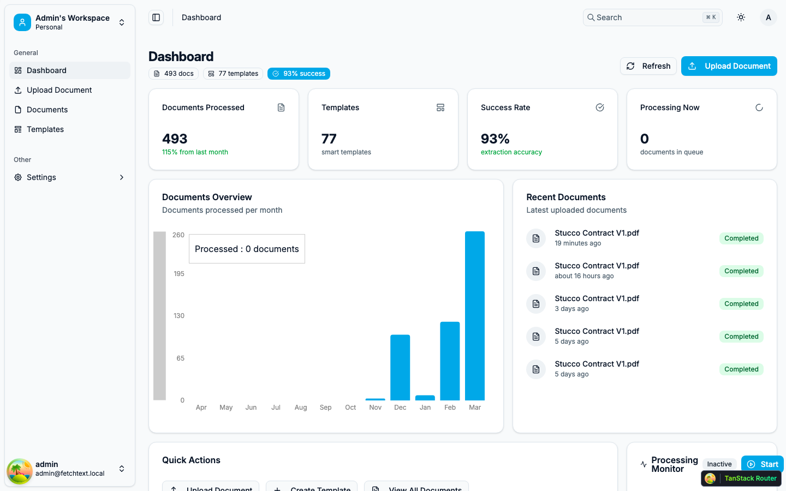
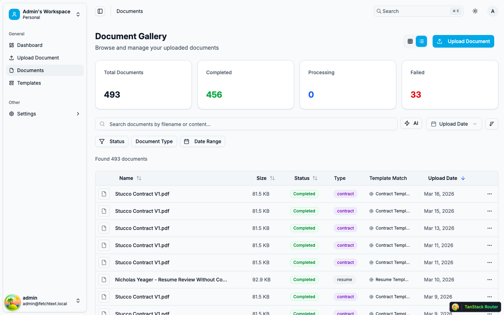
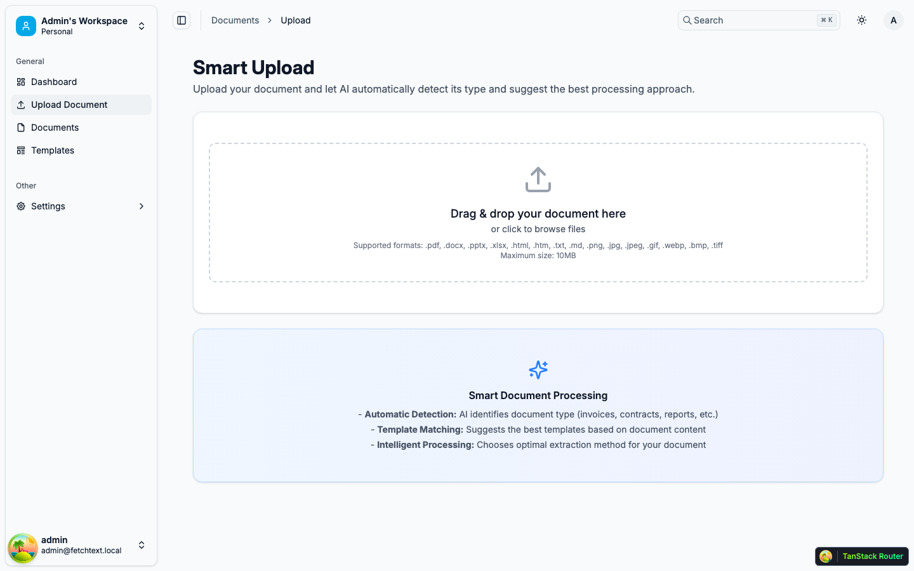
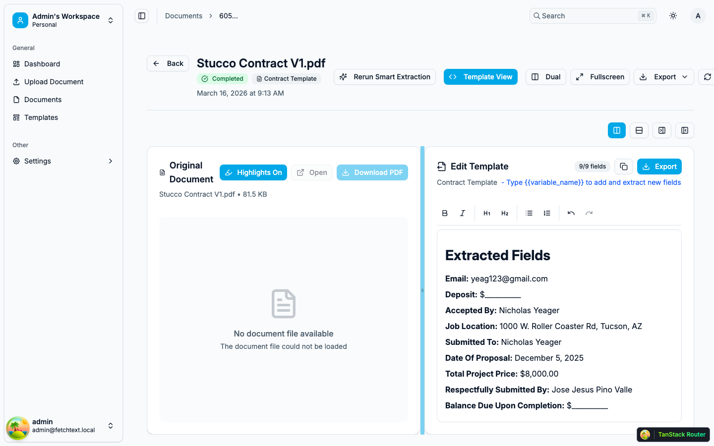
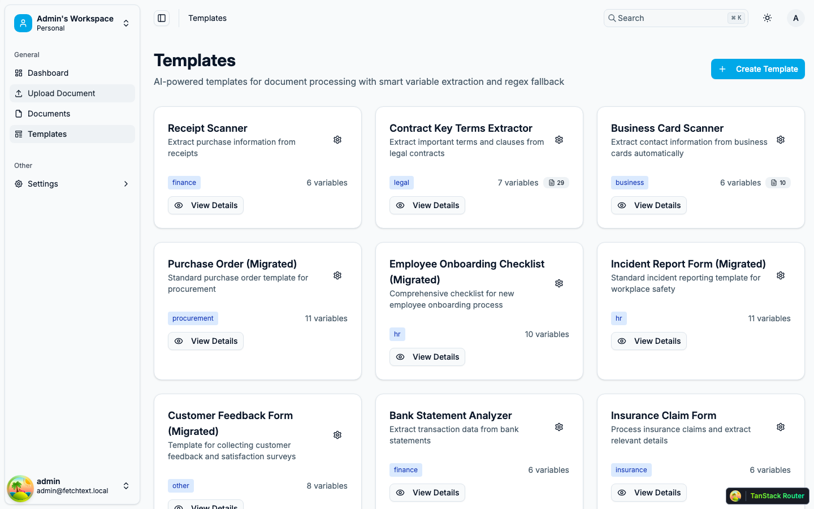
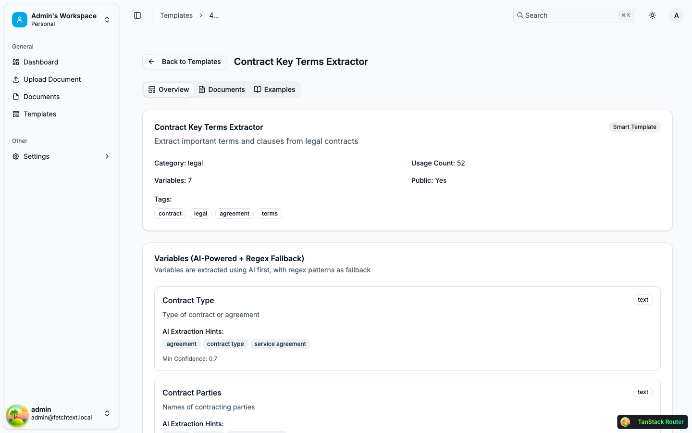
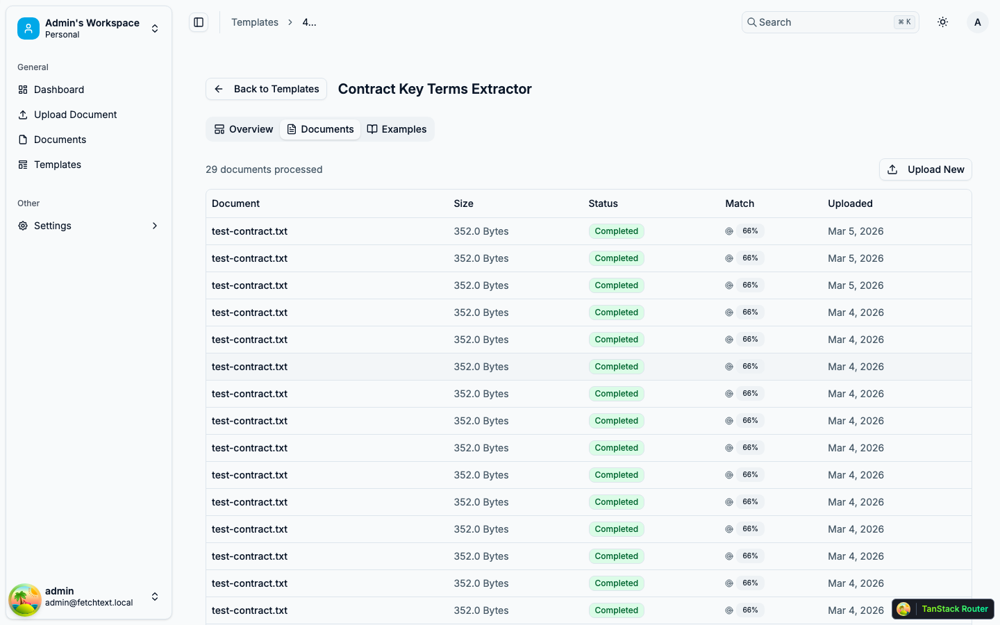
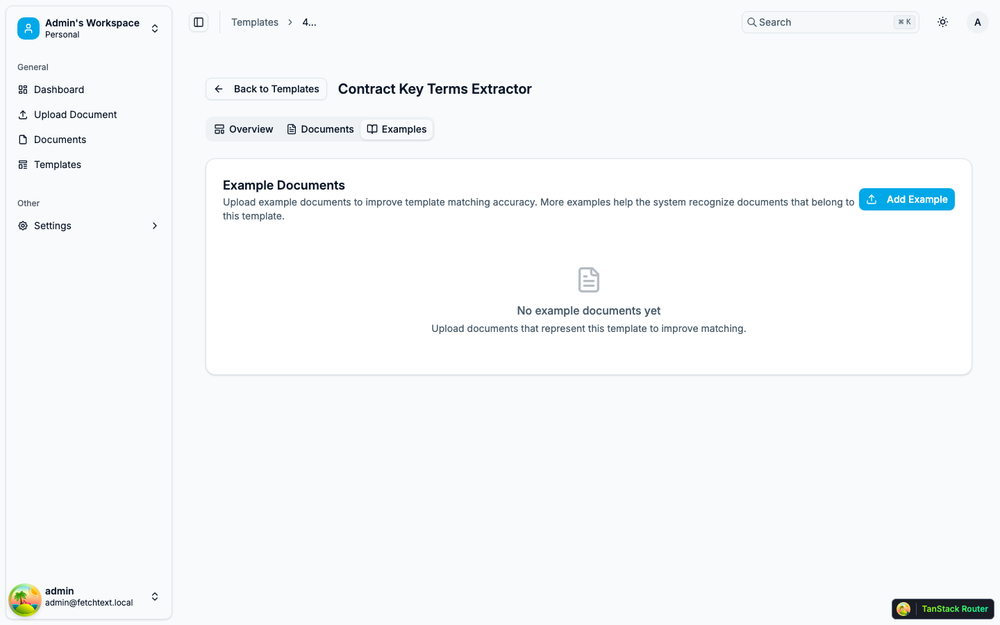
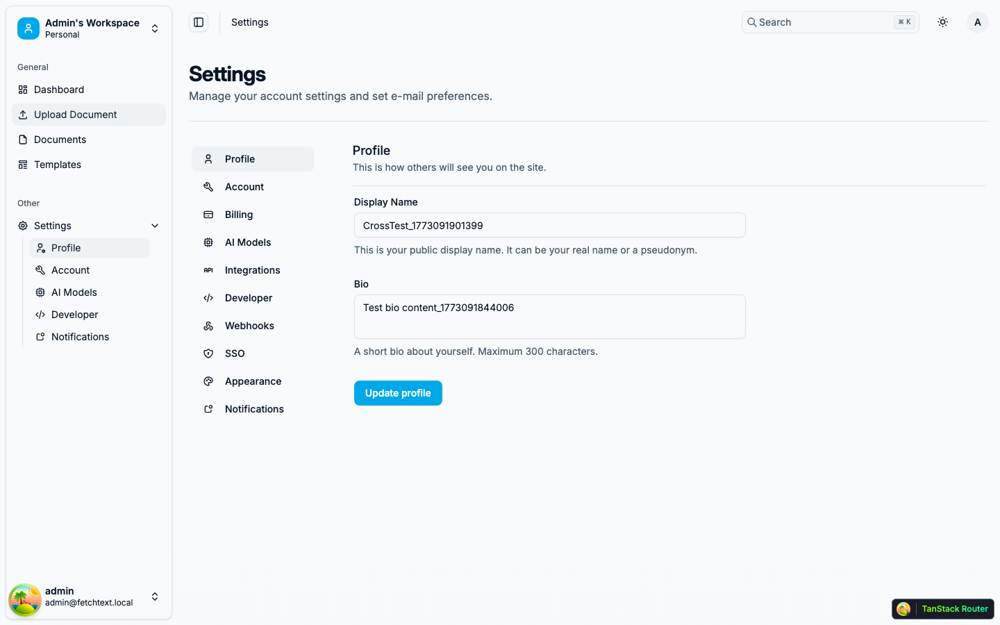

# FetchText UI Updates — March 2026

This document walks through the recent UI changes across the FetchText admin dashboard. These updates focus on **simplifying navigation**, **surfacing template matching data**, and adding **multi-exemplar support** for improved document-template matching accuracy.

---

## 1. Dashboard — Simplified Sidebar & Centralized Header

**What changed:**
- **Sidebar simplified** to 5 core items: Dashboard, Upload Document, Documents, Templates, Settings
- Removed: Gallery, Users, Tasks, Apps, Chats, Workflows, Help Center
- **Header centralized** — Search bar, theme toggle, and profile dropdown now render consistently on every page (previously passed as children per-page)
- **Breadcrumb navigation** added to header — shows current location (e.g., "Templates > 4...")
- Dashboard shows key metrics: 493 documents processed, 77 templates, 93% success rate

---

## 2. Documents List — Table View with Template Match Column

**What changed:**
- **Template Match column** added — shows which template was matched and match percentage for each document
- List/Grid toggle button in top-right to switch between table and gallery views
- Status badges (Completed, Processing, Failed) with color coding
- Filter bar with Status, Document Type, and Date Range options

---

## 3. Documents List — Gallery View Toggle

**What changed:**
- Gallery view merged into the Documents page (previously a separate `/documents/gallery` route)
- Toggle between table and card views with one click

---

## 4. Document Upload Page

**What changed:**
- Consistent sidebar and header across the upload page
- All uploads now route through the SSE streaming pipeline for real-time processing feedback

---

## 5. Document Detail — Extracted Fields

**What changed:**
- **DocumentDetailView decomposed** from 3,246 lines into a 1,640-line component + a 1,881-line `useDocumentDetail` hook
- Shows matched template name ("Contract Template") with status badge
- Dual-pane layout: original document on left, extracted fields on right
- All 9 extracted fields displayed: Email, Deposit, Accepted By, Job Location, Submitted To, Date, Total Project Price ($8,000), Submitted By, Balance Due
- Template editor with live field editing
- **Null-safe metadata access** — page no longer crashes when `document.metadata` is null/undefined

---

## 6. Templates List

**What changed:**
- Card-based layout showing template name, description, and "View Details" link
- Document count badge visible per template
- "Create Template" button in top-right

---

## 7. Template Detail — Overview Tab

**What changed:**
- **Three-tab layout**: Overview, Documents, Examples
- Overview shows template metadata: name, category, usage count, public status, tags
- Variables section shows AI extraction hints and confidence thresholds per field
- Breadcrumb navigation: Templates > 4...

---

## 8. Template Detail — Documents Tab

**What changed:**
- Shows all documents processed with this template (29 documents for Contract Key Terms Extractor)
- Columns: Document name, Size, Status, Match percentage, Upload date
- "Upload New" button to add a document and process it with this template

---

## 9. Template Detail — Examples Tab (NEW)

**What changed:**
- **Brand new "Examples" tab** for multi-exemplar template matching
- Upload example documents that represent what this template should match
- More examples = better matching accuracy (system learns from multiple angles)
- Each exemplar shows: document name, character count, index status, upload date
- "Add Example" button opens file picker for PDF, DOCX, TXT, images
- Delete individual exemplars with trash icon
- Empty state with clear call-to-action

---

## 10. Settings

**What changed:**
- Consistent sidebar and header across settings pages

---

## Backend Changes (Not Visible in UI)

### Improved Template Matching Scoring

The template matching algorithm was upgraded from a 4-component to a **5-component scoring formula**:

| Component | Old Weight | New Weight | Method |
|-----------|-----------|-----------|--------|
| Category Alignment | 30% | 25% | Same |
| Field Coverage | 25% | 20% | **NEW: Embedding-based** (was keyword matching) |
| Semantic Similarity | 35% | 30% | Same |
| Cross-Encoder Re-rank | — | **15%** | **NEW: LLM judges doc-template fit** |
| Historical Success | 10% | 10% | Same |

### Multi-Exemplar Indexing

- Templates can now have multiple example documents indexed in Qdrant
- Point ID scheme: `template_id * 10,000 + exemplar_index` (supports 9,999 exemplars per template)
- Search uses **max score** across all exemplars — best matching example wins

### New API Endpoints

| Method | Endpoint | Purpose |
|--------|----------|---------|
| POST | `/api/enhanced-documents/templates/{id}/exemplars` | Upload exemplar document |
| GET | `/api/enhanced-documents/templates/{id}/exemplars` | List exemplars |
| DELETE | `/api/enhanced-documents/templates/{id}/exemplars/{exemplar_id}` | Remove exemplar |

### Database

- New `template_exemplars` table tracking exemplar documents per template
