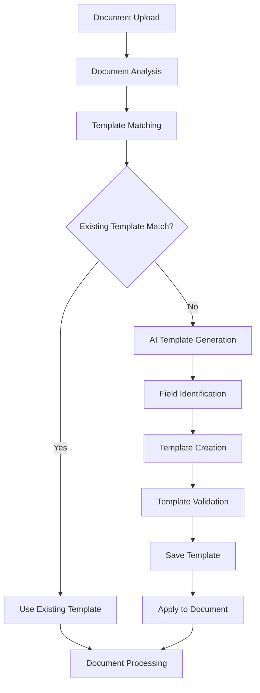

# AI-Powered Template Generation System

## Overview

The AI-Powered Template Generation System automatically creates document processing templates by analyzing uploaded documents. When a document doesn't match existing templates or when explicitly requested, the system uses AI to intelligently identify extractable fields and generates a custom template for future document processing.

## System Architecture

### Core Components



### 1. Document Analysis Engine

**Purpose**: Analyze document structure, content, and context to understand what type of document it is.

**Components**:
- **Content Extractor**: Extract text, tables, key-value pairs
- **Layout Analyzer**: Identify document structure (headers, sections, forms)
- **Pattern Detector**: Detect common patterns (dates, amounts, addresses)
- **Context Classifier**: Determine document type and domain

### 2. Template Matching System

**Purpose**: Compare analyzed document against existing templates to find the best match.

**Matching Criteria**:
- Document type similarity (>80% match)
- Field overlap (>70% of expected fields present)
- Content structure similarity
- Domain/category alignment

### 3. AI Template Generator

**Purpose**: Generate new templates when no suitable existing template is found.

**AI Components**:
- **Field Discovery AI**: Identify extractable fields using NLP
- **Template Structure AI**: Generate optimal template layout
- **Field Type Classifier**: Determine field types (text, currency, date, etc.)
- **Extraction Hints Generator**: Create extraction hints for each field

## Implementation Plan

### Phase 1: Document Analysis Enhancement

#### Backend API Endpoints

```python
# New endpoints to add to enhanced_documents.py

@router.post("/analyze-document")
async def analyze_document_for_template_generation(
    file: UploadFile = File(...),
    confidence_threshold: float = Query(0.7, description="Minimum confidence for field detection"),
    include_suggestions: bool = Query(True, description="Include field suggestions from AI")
):
    """
    Analyze document structure and content to identify potential template fields.
    Returns detailed analysis including suggested fields for template creation.
    """

@router.post("/generate-template")
async def generate_template_from_document(
    file: UploadFile = File(...),
    template_name: str = Query(..., description="Name for the generated template"),
    category: str = Query("Generated", description="Category for the template"),
    auto_save: bool = Query(False, description="Automatically save generated template"),
    field_filter: Optional[str] = Query(None, description="Comma-separated list of fields to include")
):
    """
    Generate a complete template based on document analysis.
    Optionally save the template for future use.
    """

@router.post("/suggest-template-improvements")
async def suggest_template_improvements(
    template_id: int,
    sample_documents: List[UploadFile] = File(...),
    improvement_mode: str = Query("enhance", description="Mode: enhance, optimize, or validate")
):
    """
    Analyze multiple sample documents to suggest improvements to existing templates.
    """
```

#### AI Service Components

```python
# app/services/ai_template_generator.py

class AITemplateGenerator:
    """
    AI-powered template generation service that analyzes documents
    and creates intelligent templates for data extraction.
    """
    
    async def analyze_document_structure(self, document_path: Path) -> DocumentAnalysis:
        """Analyze document structure and identify potential fields."""
        
    async def detect_extractable_fields(self, content: str, metadata: dict) -> List[FieldSuggestion]:
        """Use AI to identify fields that can be extracted from the document."""
        
    async def generate_template_from_analysis(self, analysis: DocumentAnalysis) -> GeneratedTemplate:
        """Generate a complete template based on document analysis."""
        
    async def optimize_existing_template(self, template: dict, sample_docs: List[Path]) -> TemplateOptimization:
        """Suggest improvements to existing templates based on sample documents."""
```

### Phase 2: Frontend Template Generation UI

#### New React Components

```typescript
// Template Generation Wizard
export function TemplateGenerationWizard({
  uploadedFile,
  onTemplateGenerated,
  onCancel
}: TemplateGenerationWizardProps) {
  // Step-by-step wizard for template generation
}

// Field Suggestion Interface
export function FieldSuggestionPanel({
  suggestedFields,
  onFieldToggle,
  onFieldModify
}: FieldSuggestionPanelProps) {
  // Interactive panel for reviewing and editing AI-suggested fields
}

// Template Preview
export function GeneratedTemplatePreview({
  template,
  sampleData,
  onEdit,
  onSave
}: GeneratedTemplatePreviewProps) {
  // Preview generated template with sample extraction results
}
```

#### Enhanced Document Workflow

```typescript
// Enhanced DocumentWorkflow.tsx integration

const handleDocumentAnalysis = async (file: File) => {
  // 1. Analyze document
  const analysis = await documentProcessor.analyzeDocumentForTemplateGeneration(file);
  
  // 2. Check for template matches
  const matches = await templateService.findTemplateMatches(analysis);
  
  // 3. If no good matches, offer template generation
  if (matches.length === 0 || matches[0].confidence < 0.7) {
    setShowTemplateGenerationWizard(true);
  }
};
```

### Phase 3: AI Model Integration

#### Field Detection AI

```python
class FieldDetectionAI:
    """
    AI model for detecting extractable fields in documents.
    Uses a combination of NLP techniques and pattern recognition.
    """
    
    def __init__(self):
        self.nlp_model = load_nlp_model("field_detection_v1")
        self.pattern_extractors = {
            'currency': CurrencyPatternExtractor(),
            'date': DatePatternExtractor(),
            'email': EmailPatternExtractor(),
            'phone': PhonePatternExtractor(),
            'address': AddressPatternExtractor()
        }
    
    async def detect_fields(self, content: str, document_type: str) -> List[DetectedField]:
        """
        Detect potential fields for extraction using AI analysis.
        
        Returns:
            List of detected fields with confidence scores and suggested types
        """
        
    async def generate_extraction_hints(self, field_name: str, context: str) -> List[str]:
        """Generate context-aware extraction hints for a field."""
        
    async def suggest_field_type(self, field_name: str, sample_values: List[str]) -> FieldType:
        """Suggest appropriate field type based on name and sample values."""
```

#### Template Structure AI

```python
class TemplateStructureAI:
    """
    AI for generating optimal template structures and layouts.
    """
    
    async def generate_template_content(self, fields: List[DetectedField], document_type: str) -> str:
        """Generate markdown template content with appropriate structure."""
        
    async def categorize_document(self, content: str, metadata: dict) -> DocumentCategory:
        """Classify document into appropriate category for template organization."""
        
    async def suggest_template_name(self, document_analysis: DocumentAnalysis) -> str:
        """Generate descriptive name for the template based on document analysis."""
```

## Feature Workflow

### 1. Automatic Template Generation Flow

```
1. User uploads document
2. System analyzes document structure and content
3. System searches for matching existing templates
4. If no good match found (confidence < 70%):
   a. AI analyzes document for extractable fields
   b. System generates field suggestions with types and hints
   c. User reviews and modifies suggested fields
   d. System generates complete template
   e. User tests template with original document
   f. User saves template for future use
5. Process document with new/existing template
```

### 2. Manual Template Generation Flow

```
1. User explicitly requests "Generate Template" from document
2. System performs deep analysis of document
3. AI identifies all potential extractable fields
4. User reviews comprehensive field suggestions
5. User customizes field names, types, and descriptions
6. System generates template with optimized structure
7. User tests and refines template
8. Template saved to library
```

### 3. Template Improvement Flow

```
1. User selects existing template for improvement
2. User uploads multiple sample documents of same type
3. AI analyzes documents against existing template
4. System identifies:
   - Missing fields that could be added
   - Poorly performing fields that need better hints
   - Structural improvements for better extraction
5. User reviews suggested improvements
6. Template updated with improvements
```

## AI Capabilities

### Field Detection Capabilities

| Field Type | Detection Method | Confidence Level |
|------------|------------------|------------------|
| **Currency** | Pattern + Context | 95%+ |
| **Dates** | Pattern + NLP | 90%+ |
| **Names** | NLP + Position | 85%+ |
| **Addresses** | Pattern + Context | 80%+ |
| **Phone Numbers** | Pattern Recognition | 95%+ |
| **Email** | Pattern Recognition | 98%+ |
| **IDs/Numbers** | Pattern + Context | 85%+ |
| **Custom Fields** | NLP + Context | 70%+ |

### Document Type Classification

The AI can identify and classify documents into categories:

- **Financial**: Invoices, receipts, statements, purchase orders
- **Legal**: Contracts, agreements, legal documents
- **HR**: Resumes, applications, performance reviews
- **Medical**: Lab results, prescriptions, medical records
- **Business**: Reports, presentations, correspondence
- **Government**: Forms, permits, licenses
- **Custom**: User-defined categories

### Extraction Hint Generation

The AI generates context-aware extraction hints:

```json
{
  "field_name": "vendor_name",
  "suggested_hints": [
    "vendor",
    "supplier", 
    "from",
    "company name",
    "business name",
    "seller"
  ],
  "context_specific_hints": [
    "invoice from",
    "billed by",
    "service provider"
  ]
}
```

## User Experience

### Template Generation Wizard

1. **Document Upload & Analysis**
   - Upload document
   - Real-time analysis progress
   - Document type detection

2. **Field Discovery**
   - AI-suggested fields with confidence scores
   - Interactive field editor
   - Field type auto-detection

3. **Template Customization**
   - Edit field names and descriptions
   - Adjust extraction hints
   - Preview template structure

4. **Testing & Validation**
   - Test template with original document
   - Review extraction results
   - Fine-tune fields if needed

5. **Save & Apply**
   - Save template to library
   - Apply to current document
   - Share with team (if applicable)

### Smart Suggestions

The system provides intelligent suggestions:

- **Field Naming**: Suggests descriptive, standardized field names
- **Type Detection**: Automatically detects appropriate field types
- **Hint Generation**: Creates extraction hints based on document context
- **Template Structure**: Generates organized, readable template layouts
- **Category Assignment**: Suggests appropriate template categories

## Technical Implementation

### Database Schema Extensions

```sql
-- Add to existing templates table
ALTER TABLE templates ADD COLUMN IF NOT EXISTS generation_method TEXT DEFAULT 'manual';
ALTER TABLE templates ADD COLUMN IF NOT EXISTS source_document_hash TEXT;
ALTER TABLE templates ADD COLUMN IF NOT EXISTS ai_confidence_score DECIMAL(3,2);
ALTER TABLE templates ADD COLUMN IF NOT EXISTS field_suggestions JSONB DEFAULT '[]';

-- Template generation history
CREATE TABLE template_generation_history (
    id BIGINT PRIMARY KEY GENERATED ALWAYS AS IDENTITY,
    template_id BIGINT REFERENCES templates(id),
    source_document_name TEXT,
    generation_method TEXT, -- 'ai_automatic', 'ai_assisted', 'manual'
    ai_suggestions JSONB,
    user_modifications JSONB,
    generation_time TIMESTAMP WITH TIME ZONE DEFAULT NOW(),
    confidence_score DECIMAL(3,2)
);

-- Field performance tracking
CREATE TABLE template_field_performance (
    id BIGINT PRIMARY KEY GENERATED ALWAYS AS IDENTITY,
    template_id BIGINT REFERENCES templates(id),
    field_name TEXT,
    extraction_attempts INTEGER DEFAULT 0,
    successful_extractions INTEGER DEFAULT 0,
    avg_confidence DECIMAL(3,2),
    last_updated TIMESTAMP WITH TIME ZONE DEFAULT NOW()
);
```

### API Response Formats

```typescript
interface DocumentAnalysis {
  documentType: string;
  confidence: number;
  suggestedCategory: string;
  detectedFields: DetectedField[];
  structuralElements: StructuralElement[];
  extractionComplexity: 'simple' | 'moderate' | 'complex';
}

interface DetectedField {
  name: string;
  suggestedType: FieldType;
  confidence: number;
  sampleValues: string[];
  extractionHints: string[];
  position: FieldPosition;
  importance: 'high' | 'medium' | 'low';
}

interface GeneratedTemplate {
  name: string;
  description: string;
  category: string;
  templateContent: string;
  variables: SmartVariable[];
  extractionRules: ExtractionRule[];
  aiConfidence: number;
  generationMethod: string;
}
```

## Benefits

### For Users
- **Reduced Manual Work**: Automatic template creation from any document
- **Improved Accuracy**: AI-generated templates often perform better than manual ones
- **Faster Processing**: Templates ready immediately for new document types
- **Learning System**: Templates improve automatically over time

### For Organizations
- **Scalability**: Handle new document types without manual template creation
- **Consistency**: Standardized field naming and extraction patterns
- **Adaptability**: Templates evolve with changing document formats
- **Cost Efficiency**: Reduced time spent on template maintenance

### For Developers
- **Extensible**: Easy to add new field types and detection methods
- **Observable**: Comprehensive analytics on template performance
- **Maintainable**: AI handles template optimization automatically
- **Flexible**: Support for custom business rules and requirements

## Future Enhancements

### Advanced AI Capabilities
- **Multi-document Learning**: Generate templates from multiple sample documents
- **Cross-format Support**: Handle different formats of the same document type
- **Semantic Understanding**: Better context awareness for field detection
- **Domain Expertise**: Specialized models for specific industries

### Integration Features
- **Workflow Integration**: Auto-generate templates in existing workflows
- **API Access**: Programmatic template generation for developers
- **Batch Processing**: Generate multiple templates from document batches
- **Version Control**: Track template evolution and performance over time

### Enterprise Features
- **Team Collaboration**: Shared template libraries with approval workflows
- **Compliance Tools**: Ensure templates meet regulatory requirements
- **Custom Models**: Train custom AI models for specific document types
- **Analytics Dashboard**: Comprehensive insights into template performance

This AI-powered template generation system would revolutionize how users handle new document types, making the platform truly adaptive and intelligent.