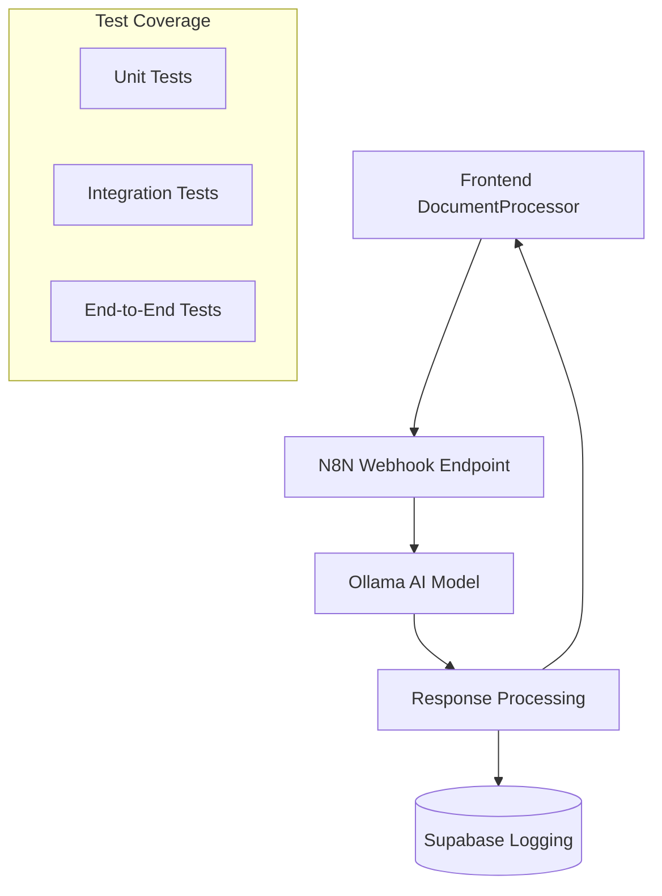

# Ollama Document Extraction Integration Testing

This document outlines the setup and execution of integration tests for real Ollama-powered document extraction using the N8N workflow system.

## 📋 Overview

The integration testing system validates the complete document processing pipeline:

1. **Frontend** → **N8N Webhook** → **Ollama AI** → **Response Processing** → **Frontend**

## 🏗️ Architecture



## 📁 Test Structure

### Integration Test File
- **Location**: `src/__tests__/integration/ollama-document-extraction.test.tsx`
- **Purpose**: Tests real Ollama integration via N8N webhooks
- **Timeout**: 30 seconds per test (AI processing can be slow)

### Test Runner Utility
- **Location**: `src/__tests__/utils/ollama-integration-runner.ts`
- **Purpose**: Setup validation and test execution automation

## 🔧 N8N Workflow Structure

Based on `n8n-tool-workflows/Document_Template_AI_Extraction.json`:

### Workflow Nodes:
1. **Webhook Trigger** (`document-extraction`)
   - Receives POST requests with document data
   - Path: `/webhook/document-extraction`

2. **Extract Input Data** (Set Node)
   - Parses incoming payload:
     - `document_text`: Raw document content
     - `template_fields`: Smart variable definitions
     - `extraction_prompt`: AI prompt for extraction

3. **Ollama AI Extraction** (Ollama Chat Model)
   - Model: `llama3.2:latest`
   - Temperature: 0.1 (precise extraction)
   - Top P: 0.9

4. **Process AI Response** (Code Node)
   - Cleans and parses AI JSON response
   - Handles type conversions (currency, dates, etc.)
   - Validates against template fields

5. **Check Extraction Success** (If Node)
   - Routes to success or error handling

6. **Format Response** (Set Nodes)
   - Success: Returns extracted data with confidence metrics
   - Error: Returns error message and raw response

7. **Webhook Response** 
   - Returns JSON response to frontend

8. **Log Processing Job** (Supabase)
   - Logs extraction attempts to database

## 🧪 Test Scenarios

### 1. Basic Connectivity
```typescript
it('should connect to N8N webhook endpoint')
```
- Tests N8N service availability
- Validates webhook endpoint accessibility

### 2. Real AI Extraction
```typescript
it('should extract data from document using real Ollama via N8N')
```
- Sends actual document text to Ollama
- Validates extraction accuracy
- Checks response format and metrics

### 3. Error Handling
```typescript
it('should handle Ollama extraction errors gracefully')
```
- Tests malformed input handling
- Validates error response structure

### 4. Document Format Variations
```typescript
it('should handle different document types and formats')
```
- Tests email format documents
- Tests structured format documents
- Validates field extraction consistency

### 5. Component Integration
```typescript
it('should integrate with DocumentProcessor component')
```
- Tests frontend component integration
- Validates UI updates with real data

## 📝 Payload Structure

### Request to N8N Webhook:
```json
{
  "document_text": "Raw document content...",
  "template_fields": [
    {
      "id": "client_name",
      "name": "client_name", 
      "type": "text",
      "description": "Client company name",
      "extraction_hints": ["client", "company", "organization"]
    }
  ],
  "extraction_prompt": "Extract the following information...",
  "user_id": "user-123",
  "timestamp": 1641234567890
}
```

### Response from N8N Webhook:
```json
{
  "status": "success",
  "data": {
    "client_name": "Acme Corporation",
    "project_amount": "$25,000",
    "contact_email": "client@acme.com"
  },
  "confidence": 0.85,
  "processing_time_ms": 1200
}
```

## 🚀 Setup Instructions

### Prerequisites
1. **Docker Services Running**:
   ```bash
   docker compose up -d
   ```

2. **N8N Workflow Deployed**:
   - Open http://localhost:5678
   - Import `n8n-tool-workflows/Document_Template_AI_Extraction.json`
   - Activate the workflow

3. **Ollama Model Available**:
   - Ensure `llama3.2:latest` is pulled in Ollama
   - Verify Ollama is accessible from N8N container

### Running Tests

#### Method 1: Manual Test Execution
```bash
cd localai-admin-dashboard
npm run test -- src/__tests__/integration/ollama-document-extraction.test.tsx
```

#### Method 2: Automated Setup & Testing
```bash
cd localai-admin-dashboard
npx tsx src/__tests__/utils/ollama-integration-runner.ts
```

The automated script will:
1. Validate N8N workflow file structure
2. Check N8N service status
3. Verify workflow deployment
4. Run integration tests with proper reporting

## 🔍 Debugging

### N8N Workflow Debugging:
1. **Check Execution History**:
   - N8N UI → Executions tab
   - View detailed execution logs

2. **Ollama Node Debugging**:
   - Check Ollama model availability
   - Review prompt construction
   - Validate AI response format

3. **Code Node Debugging**:
   - Check JSON parsing logic
   - Validate type conversion functions
   - Review field mapping

### Test Debugging:
1. **Service Availability**:
   ```bash
   curl http://localhost:5678/health
   curl -X POST http://localhost:5678/webhook/document-extraction
   ```

2. **Ollama Direct Testing**:
   ```bash
   docker exec ollama ollama run llama3.2:latest "Extract client name from: Acme Corp project proposal"
   ```

## 📊 Test Results Analysis

### Success Metrics:
- **Extraction Accuracy**: Field values match document content
- **Response Time**: < 10 seconds per extraction
- **Confidence Score**: > 0.7 for clear documents
- **Error Handling**: Graceful degradation for invalid inputs

### Performance Benchmarks:
- **Simple Documents** (< 500 words): ~2-5 seconds
- **Complex Documents** (> 1000 words): ~5-15 seconds
- **Multiple Fields** (7+ fields): ~3-10 seconds

## 🔄 Integration with DocumentProcessor

The integration tests validate the complete flow:

1. **File Upload** → Text extraction
2. **AI Processing** → N8N webhook call  
3. **Data Extraction** → Ollama processing
4. **Response Handling** → UI updates
5. **Document Generation** → Template population

## 🎯 Next Steps

1. **Performance Optimization**:
   - Implement prompt caching
   - Optimize AI model parameters
   - Add parallel processing for multiple fields

2. **Enhanced Testing**:
   - Add load testing for concurrent extractions
   - Implement visual regression testing
   - Add accessibility testing

3. **Production Readiness**:
   - Add comprehensive error monitoring
   - Implement retry mechanisms
   - Add performance analytics

## 📚 Related Documentation

- [Document Generation Plan](./DOCUMENT_GENERATION_PLAN.md)
- [N8N Workflows](../n8n-tool-workflows/)
- [Component Testing Guide](./src/__tests__/README.md)

---

**Status**: ✅ **Ready for Testing**

The integration testing framework is complete and ready to validate real Ollama document extraction capabilities. 