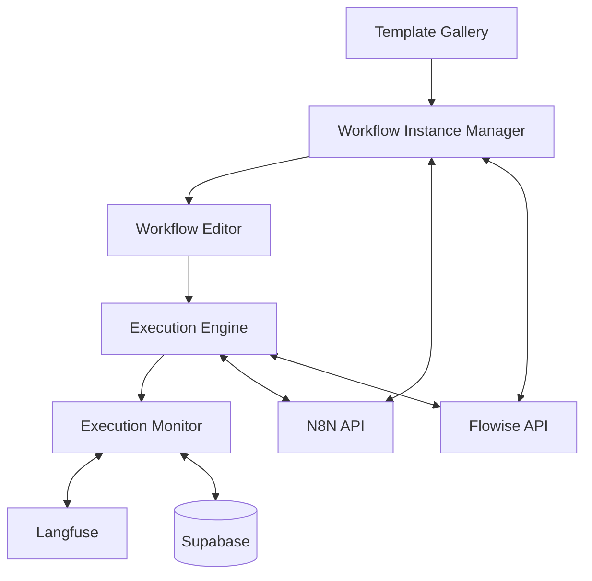

# Workflow Editor, Manager, and Execution System Plan

## Overview

This plan outlines the complete implementation of a workflow editor/manager with N8N and Flowise integration, plus execution and monitoring capabilities. This builds upon the existing template gallery to provide end-to-end workflow automation.

## Architecture Overview



## Phase 1: Workflow Instance Manager (Week 1)

### 1.1 Core Components

#### A. Workflow Instance Service (`src/lib/workflow-instance-service.ts`)
```typescript
export class WorkflowInstanceService {
  // Instance Management
  static async getInstances(userId?: string): Promise<WorkflowInstance[]>
  static async getInstance(id: string): Promise<WorkflowInstance | null>
  static async updateInstance(id: string, updates: Partial<WorkflowInstance>): Promise<void>
  static async deleteInstance(id: string): Promise<void>
  static async activateInstance(id: string): Promise<void>
  static async deactivateInstance(id: string): Promise<void>
  
  // Configuration Management
  static async updateConfiguration(id: string, config: any): Promise<void>
  static async validateConfiguration(templateType: string, config: any): Promise<boolean>
}
```

#### B. Instance Manager UI (`src/routes/_authenticated/workflows/instances/index.tsx`)
```typescript
function WorkflowInstancesPage() {
  // Features:
  // - List all user's workflow instances
  // - Filter by template type, status, created date
  // - Search by name/description
  // - Quick actions: activate/deactivate, edit, delete
  // - Bulk operations
  // - Instance health status indicators
}
```

#### C. Instance Detail Page (`src/routes/_authenticated/workflows/instances/$instanceId.tsx`)
```typescript
function WorkflowInstanceDetailPage() {
  // Features:
  // - Instance metadata display
  // - Configuration editor
  // - Execution history
  // - Real-time status monitoring
  // - Edit/Deploy buttons
  // - Performance metrics
}
```

### 1.2 Database Enhancements

Add columns to `workflow_instances` table:
```sql
ALTER TABLE workflow_instances ADD COLUMN deployed_workflow_id TEXT; -- N8N/Flowise workflow ID
ALTER TABLE workflow_instances ADD COLUMN deployment_status TEXT CHECK (deployment_status IN ('draft', 'deploying', 'active', 'inactive', 'error'));
ALTER TABLE workflow_instances ADD COLUMN last_executed_at TIMESTAMP WITH TIME ZONE;
ALTER TABLE workflow_instances ADD COLUMN execution_count INTEGER DEFAULT 0;
ALTER TABLE workflow_instances ADD COLUMN deployment_error TEXT;
```

## Phase 2: N8N & Flowise API Integration (Week 2)

### 2.1 N8N Client Service (`src/lib/n8n-client.ts`)

```typescript
export class N8nClient {
  private baseUrl: string = 'http://localhost:5678/api/v1';
  private apiKey?: string;

  // Workflow Management
  async getWorkflows(): Promise<N8nWorkflow[]>
  async getWorkflow(id: string): Promise<N8nWorkflow>
  async createWorkflow(workflow: N8nWorkflowData): Promise<string>
  async updateWorkflow(id: string, workflow: N8nWorkflowData): Promise<void>
  async deleteWorkflow(id: string): Promise<void>
  
  // Activation Management
  async activateWorkflow(id: string): Promise<void>
  async deactivateWorkflow(id: string): Promise<void>
  async getWorkflowStatus(id: string): Promise<WorkflowStatus>
  
  // Execution Management
  async executeWorkflow(id: string, data?: any): Promise<ExecutionResult>
  async getExecutions(workflowId?: string): Promise<N8nExecution[]>
  async getExecution(id: string): Promise<N8nExecution>
  async cancelExecution(id: string): Promise<void>
  
  // Credentials & Settings
  async getCredentials(): Promise<N8nCredential[]>
  async testWorkflow(workflow: N8nWorkflowData): Promise<TestResult>
}
```

### 2.2 Flowise Client Service (`src/lib/flowise-client.ts`)

```typescript
export class FlowiseClient {
  private baseUrl: string = 'http://localhost:3000/api/v1';
  private apiKey?: string;

  // Chatflow Management
  async getChatflows(): Promise<FlowiseChatflow[]>
  async getChatflow(id: string): Promise<FlowiseChatflow>
  async createChatflow(chatflow: FlowiseChatflowData): Promise<string>
  async updateChatflow(id: string, chatflow: FlowiseChatflowData): Promise<void>
  async deleteChatflow(id: string): Promise<void>
  
  // Execution Management
  async executeChatflow(id: string, question: string, history?: any[]): Promise<FlowiseResponse>
  async getChatflowHistory(id: string): Promise<FlowiseHistory[]>
  
  // Tools & Nodes
  async getAvailableNodes(): Promise<FlowiseNode[]>
  async getNodeDetails(nodeType: string): Promise<FlowiseNodeDetails>
}
```

### 2.3 Unified Workflow Client (`src/lib/workflow-client.ts`)

```typescript
export class WorkflowClient {
  private n8nClient: N8nClient;
  private flowiseClient: FlowiseClient;

  async deployInstance(instance: WorkflowInstance): Promise<string> {
    switch (instance.templateType) {
      case 'n8n':
        return this.deployN8nWorkflow(instance);
      case 'flowise':
        return this.deployFlowiseChatflow(instance);
      case 'hybrid':
        return this.deployHybridWorkflow(instance);
    }
  }

  async executeInstance(instance: WorkflowInstance, input?: any): Promise<ExecutionResult> {
    // Route to appropriate execution engine
  }

  async getInstanceStatus(instance: WorkflowInstance): Promise<WorkflowStatus> {
    // Get real-time status from deployment platform
  }
}
```

## Phase 3: Workflow Editor Integration (Week 3-4)

### 3.1 Approach: Hybrid Editor Strategy

Rather than rebuilding N8N/Flowise editors, implement a hybrid approach:

#### A. Lightweight Visual Editor (`src/components/workflow/WorkflowEditor.tsx`)
```typescript
// Using React Flow for basic workflow visualization
export function WorkflowEditor({ instance, onSave }: WorkflowEditorProps) {
  // Features:
  // - Visual representation of workflow nodes
  // - Basic node editing (parameters only)
  // - Connection visualization
  // - Read-only for complex workflows
  // - "Edit in N8N/Flowise" deep-link button
}
```

#### B. Configuration Editor (`src/components/workflow/ConfigurationEditor.tsx`)
```typescript
export function ConfigurationEditor({ instance, onSave }: ConfigurationEditorProps) {
  // Features:
  // - JSON editor for workflow configuration
  // - Parameter validation
  // - Environment variable management
  // - Credential selection
  // - Test execution capability
}
```

#### C. Deep-Link Integration
```typescript
export function ExternalEditorButton({ instance }: ExternalEditorButtonProps) {
  const openInN8n = () => {
    // Open specific workflow in N8N editor
    window.open(`http://localhost:5678/workflow/${instance.deployedWorkflowId}`, '_blank');
  };
  
  const openInFlowise = () => {
    // Open specific chatflow in Flowise editor
    window.open(`http://localhost:3000/chatflows/${instance.deployedWorkflowId}`, '_blank');
  };
}
```

### 3.2 Node Palette & Templates

#### A. Node Library (`src/components/workflow/NodePalette.tsx`)
```typescript
export function NodePalette({ templateType, onAddNode }: NodePaletteProps) {
  // Features:
  // - Categorized node types (triggers, actions, AI, etc.)
  // - Drag-and-drop to canvas
  // - Node search and filtering
  // - Recent/favorite nodes
  // - Custom node templates
}
```

#### B. Node Configuration Panel (`src/components/workflow/NodeConfigPanel.tsx`)
```typescript
export function NodeConfigPanel({ node, onUpdate }: NodeConfigPanelProps) {
  // Features:
  // - Dynamic form generation based on node type
  // - Parameter validation
  // - Credential management
  // - Test node functionality
  // - Documentation links
}
```

## Phase 4: Execution Engine (Week 5)

### 4.1 Execution Service (`src/lib/execution-service.ts`)

```typescript
export class ExecutionService {
  // Direct Execution
  static async executeInstance(instanceId: string, input?: any): Promise<string>
  static async scheduleExecution(instanceId: string, schedule: string): Promise<void>
  static async cancelExecution(executionId: string): Promise<void>
  
  // Batch Execution
  static async executeBatch(instanceIds: string[], input?: any): Promise<BatchResult>
  
  // Webhook Execution (for N8N webhooks)
  static async registerWebhook(instanceId: string): Promise<string>
  static async unregisterWebhook(instanceId: string): Promise<void>
  
  // Status & Results
  static async getExecutionStatus(executionId: string): Promise<ExecutionStatus>
  static async getExecutionResult(executionId: string): Promise<ExecutionResult>
  static async getExecutionLogs(executionId: string): Promise<ExecutionLog[]>
}
```

### 4.2 Real-time Execution Monitoring

#### A. Execution Dashboard (`src/routes/_authenticated/workflows/executions/index.tsx`)
```typescript
function ExecutionsPage() {
  // Features:
  // - Real-time execution feed
  // - Filter by status, instance, date range
  // - Execution statistics
  // - Performance metrics
  // - Error analysis
}
```

#### B. Live Execution View (`src/components/workflow/LiveExecutionView.tsx`)
```typescript
export function LiveExecutionView({ executionId }: LiveExecutionViewProps) {
  // Features:
  // - Real-time progress tracking
  // - Node-by-node execution status
  // - Live logs streaming
  // - Input/output data display
  // - Error highlighting
}
```

### 4.3 WebSocket Integration for Real-time Updates

```typescript
// src/lib/execution-websocket.ts
export class ExecutionWebSocket {
  connect(executionId: string): void
  subscribe(callback: (update: ExecutionUpdate) => void): void
  unsubscribe(): void
}
```

## Phase 5: Monitoring & Analytics (Week 6)

### 5.1 Execution Analytics (`src/lib/analytics-service.ts`)

```typescript
export class AnalyticsService {
  // Performance Metrics
  static async getExecutionMetrics(instanceId: string, timeRange: TimeRange): Promise<Metrics>
  static async getSystemPerformance(): Promise<SystemMetrics>
  
  // Usage Analytics
  static async getUsageStats(userId?: string): Promise<UsageStats>
  static async getPopularTemplates(): Promise<TemplateStats[]>
  
  // Error Analysis
  static async getErrorStats(timeRange: TimeRange): Promise<ErrorStats>
  static async getFailurePatterns(): Promise<FailurePattern[]>
}
```

### 5.2 Monitoring Dashboard (`src/routes/_authenticated/workflows/monitoring/index.tsx`)

```typescript
function MonitoringPage() {
  // Features:
  // - System health overview
  // - Execution success rates
  // - Performance trends
  // - Resource utilization
  // - Alert management
  // - Export capabilities
}
```

### 5.3 Langfuse Integration for LLM Monitoring

```typescript
// src/lib/langfuse-integration.ts
export class LangfuseService {
  static async trackExecution(execution: WorkflowExecution): Promise<void>
  static async trackLLMCall(nodeId: string, input: string, output: string): Promise<void>
  static async getExecutionTraces(executionId: string): Promise<LangfuseTrace[]>
}
```

## Phase 6: Advanced Features (Week 7-8)

### 6.1 Workflow Testing & Validation

#### A. Test Suite Manager (`src/components/workflow/TestSuite.tsx`)
```typescript
export function TestSuite({ instance }: TestSuiteProps) {
  // Features:
  // - Create test cases with input/expected output
  // - Automated testing on configuration changes
  // - Performance benchmarking
  // - Regression testing
  // - Test result history
}
```

#### B. Validation Service (`src/lib/validation-service.ts`)
```typescript
export class ValidationService {
  static async validateWorkflow(config: any, templateType: string): Promise<ValidationResult>
  static async testConnections(config: any): Promise<ConnectionTest[]>
  static async validateCredentials(credentialIds: string[]): Promise<CredentialValidation[]>
}
```

### 6.2 Workflow Versioning & Rollback

```typescript
// Enhanced workflow_instances table
ALTER TABLE workflow_instances ADD COLUMN version INTEGER DEFAULT 1;
CREATE TABLE workflow_versions (
  id UUID PRIMARY KEY DEFAULT gen_random_uuid(),
  instance_id UUID REFERENCES workflow_instances(id) ON DELETE CASCADE,
  version INTEGER NOT NULL,
  configuration JSONB NOT NULL,
  created_at TIMESTAMP WITH TIME ZONE DEFAULT NOW(),
  created_by UUID REFERENCES auth.users(id),
  change_notes TEXT,
  UNIQUE(instance_id, version)
);
```

### 6.3 Advanced Scheduling & Triggers

```typescript
// src/lib/scheduler-service.ts
export class SchedulerService {
  static async createSchedule(instanceId: string, schedule: ScheduleConfig): Promise<string>
  static async updateSchedule(scheduleId: string, schedule: ScheduleConfig): Promise<void>
  static async deleteSchedule(scheduleId: string): Promise<void>
  static async getSchedules(instanceId?: string): Promise<Schedule[]>
}
```

## Implementation Timeline

### Week 1: Foundation
- [ ] Workflow Instance Manager UI
- [ ] Basic instance CRUD operations
- [ ] Database schema updates
- [ ] Instance status tracking

### Week 2: API Integration
- [ ] N8N Client implementation
- [ ] Flowise Client implementation
- [ ] Unified Workflow Client
- [ ] Deployment pipeline

### Week 3-4: Editor Integration
- [ ] Visual workflow viewer
- [ ] Configuration editor
- [ ] Deep-link integration
- [ ] Node palette (basic)

### Week 5: Execution Engine
- [ ] Execution Service implementation
- [ ] Real-time monitoring
- [ ] WebSocket integration
- [ ] Execution dashboard

### Week 6: Monitoring & Analytics
- [ ] Analytics service
- [ ] Monitoring dashboard
- [ ] Langfuse integration
- [ ] Performance metrics

### Week 7-8: Advanced Features
- [ ] Testing & validation
- [ ] Versioning system
- [ ] Advanced scheduling
- [ ] Error handling & recovery

## Technical Considerations

### Security
- **API Key Management**: Store N8N/Flowise API keys securely in environment variables
- **User Authentication**: Integrate with Supabase Auth for all operations
- **Credential Handling**: Never store credentials in workflow configurations
- **Access Control**: Implement proper RBAC for workflow management

### Performance
- **Caching**: Cache workflow definitions and execution results
- **Pagination**: Implement proper pagination for large result sets
- **Background Jobs**: Use Supabase Edge Functions for long-running operations
- **Rate Limiting**: Implement rate limiting for API calls

### Scalability
- **Database Optimization**: Add proper indexes for query performance
- **Execution Queuing**: Implement execution queue for high-volume scenarios
- **Resource Monitoring**: Track resource usage and implement limits
- **Error Recovery**: Implement robust error handling and retry mechanisms

### Monitoring & Observability
- **Execution Tracking**: Track all execution steps and performance
- **Error Logging**: Comprehensive error logging and analysis
- **Performance Metrics**: Monitor system performance and bottlenecks
- **User Analytics**: Track user behavior and feature usage

## Success Metrics

### Functional Metrics
- **Deployment Success Rate**: >95% successful deployments
- **Execution Success Rate**: >90% successful executions
- **Response Time**: <2s for workflow operations
- **Uptime**: >99.5% system availability

### User Experience Metrics
- **Time to Deploy**: <5 minutes from template to running workflow
- **User Adoption**: Track active users and workflow creation rates
- **Error Resolution**: <1 hour average time to resolve issues
- **User Satisfaction**: Collect feedback and iterate

## Risk Mitigation

### Technical Risks
- **API Changes**: Monitor N8N/Flowise API versions and maintain compatibility
- **Performance Issues**: Implement monitoring and optimization strategies
- **Data Loss**: Implement proper backup and recovery procedures
- **Security Vulnerabilities**: Regular security audits and updates

### Operational Risks
- **Service Dependencies**: Implement fallback mechanisms for external services
- **Resource Constraints**: Monitor and plan for resource scaling
- **User Errors**: Implement validation and safety checks
- **System Complexity**: Maintain clear documentation and testing procedures

This comprehensive plan provides a roadmap for implementing a complete workflow management system that integrates seamlessly with your existing N8N and Flowise infrastructure while providing a modern, user-friendly interface for workflow creation, deployment, and monitoring.
